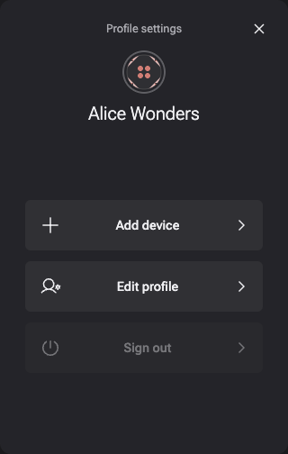
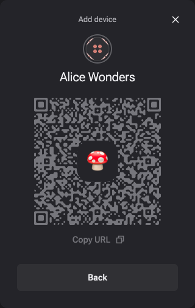
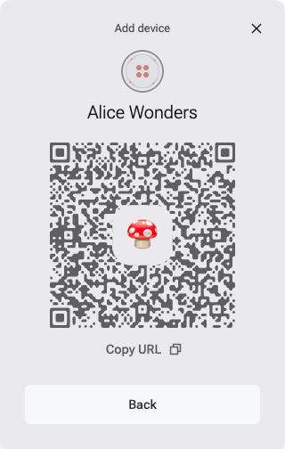

# Shell

The shell is a set of components and pre-built workflows for managing [ECHO](../platform) spaces, invitations, and identity.

It runs as part of the vault and renders within the vault iframe controlled by DXOS client.

The shell can be invoked via the client API.

Scenarios:

*   View and edit the user's basic profile
*   Invite someone to a space
*   Accept an invitation to join another space
*   Join another device to the user's HALO identity
*   Accept a device invitation to join the current device to an existing HALO identity

The shell appears overtop the calling UI and looks like a full screen dialog panel.

<div class="shell-images" style="display: flex; flex-direction: row; gap: 2em;">
  
  

  
  
</div>

## Installation

Shell is part of the DXOS client:

```bash
npm i @dxos/react-client
```

## Usage

```tsx file=./snippets/shell.tsx#L5-
import React from 'react';

import { useClient, PublicKey } from '@dxos/react-client';

const Component = () => {
  // requires <ClientProvider/> somewhere in the tree
  const client = useClient();

  return (
    <div
      onClick={async () => {
        // open the profile panel
        client.shell.open();

        // join another device using an invitation
        const { identity: id1 } = await client.shell.initializeIdentity({
          invitationCode: '<device invitation code>',
        });

        // open the identity creation flow
        const { identity: id2, cancelled } =
          await client.shell.initializeIdentity();

        // invite a new device to join the current identity
        const { device } = await client.shell.shareIdentity();

        // invite new members to join a space
        const { members } = await client.shell.shareSpace({
          spaceKey: PublicKey.from('<space key>'),
        });

        // join an existing space
        const { space } = await client.shell.joinSpace({
          invitationCode: '<invitation code>',
        });
      }}
    ></div>
  );
};
```

See more in the [API documentation](../../api/@dxos/client/classes/Client.md#shell) for the Shell.
