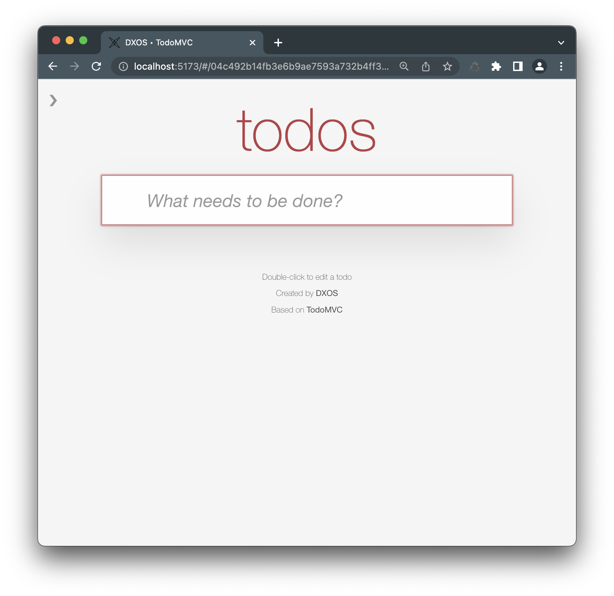

# Sample Code

## Tasks

A simple list app built with the DXOS application [template](./cli/app-templates).

*   Code on [Github](https://github.com/dxos/dxos/tree/main/packages/apps/tasks-app)
*   Run [Tasks](http://tasks.dxos.org) on `dxos.org`
    

## Composer

A collaborative, real-time, offline-first full-text editor with [`TipTap`](https://tiptap.dev/) and `dxos`.

*   Code on [Github](https://github.com/dxos/dxos/tree/main/packages/apps/composer-app)
*   Run [Composer](http://composer.dxos.org) on `dxos.org`
    

## TodoMVC

A fork of the [TodoMVC](https://todomvc.com/) sample running on top of `dxos`

*   Code on [Github](https://github.com/dxos/dxos/tree/main/packages/apps/todomvc)
*   Run [TodoMVC](http://todomvc.kube.dxos.org) on `dxos.org`
    
