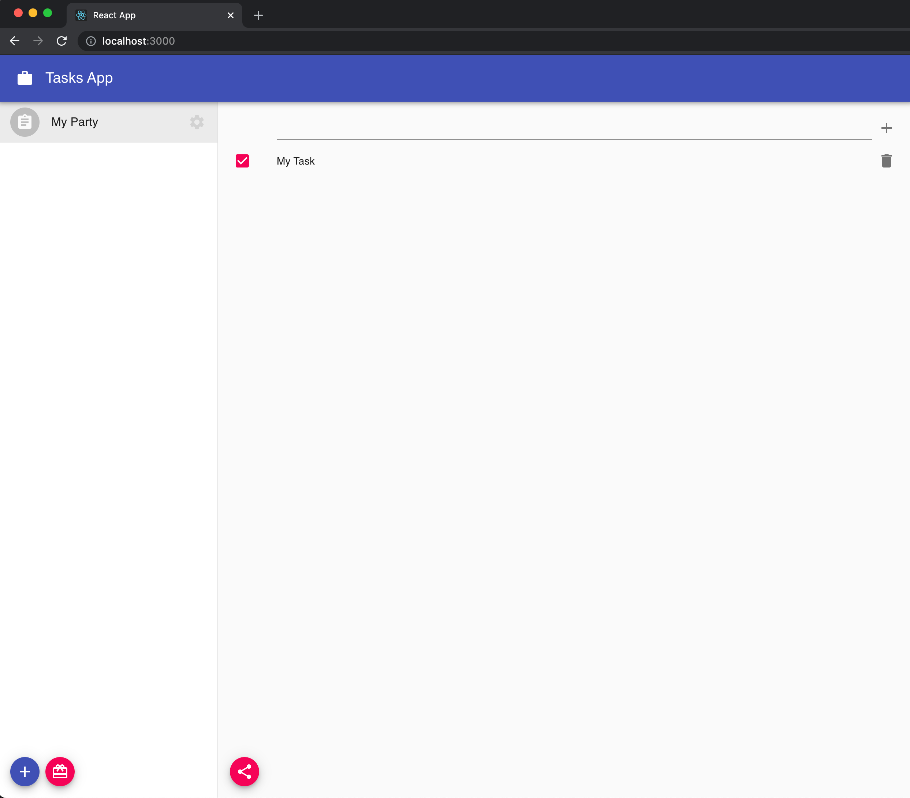

## Updating items

Let's add the possibility to check/uncheck our tasks to mark which ones are already completed. Pay attention to `handleToggleComplete` and you will see how we update a property of an item:

```jsx:title=src/components/TaskList.js
import { ObjectModel } from '@dxos/object-model';
import { usespace, useSelection } from '@dxos/react-client';

const TASK_TYPE = 'example.com/type/task';

const TaskList = ({ space_key }) => {
  // ...

  const handleToggleComplete = (item) => async (event) => {
    await item.model.setProperty('complete', event.target.checked);
  };

  return (
    <div>
      <List dense>
        {/* ... Creation Input */}

        {items.map((item) => (
          <ListItem button key={item.id}>
            <ListItemIcon>
              <Checkbox
                edge='start'
                tabIndex={-1}
                checked={item.model.getProperty('complete') || false}
                onChange={handleToggleComplete(item)}
              />
            </ListItemIcon>

            <ListItemText primary={item.model.getProperty('title')} />
          </ListItem>
        ))}
      </List>

      {/* ... Share Button */}
    </div>
  );
};
```

If you go back to your app, you should now be able to check and uncheck them.


## Deleting items

To complete the famous CRUD operations, we just need to add a deletion option. Let's add a button to each task to make it happen. As are making a soft-delete of the items, we just need to update it's `deleted` property:

```jsx:title=src/components/TaskList.js
import { ObjectModel } from '@dxos/object-model';
import { usespace, useSelection } from '@dxos/react-client';

const TASK_TYPE = 'example.com/type/task';

const TaskList = ({ space_key }) => {
  // ...

  const handleDeleteTask = (item) => async () => {
    await item.model.setProperty('deleted', true);
  };

  return (
    <div>
      <List dense>
        {/* ... Creation Input */}

        {items.map((item) => (
          <ListItem button key={item.id}>
            <ListItemIcon>
              <Checkbox
                edge='start'
                tabIndex={-1}
                checked={item.model.getProperty('complete') || false}
                onChange={handleToggleComplete(item)}
              />
            </ListItemIcon>

            <ListItemText primary={item.model.getProperty('title')} />

            <ListItemSecondaryAction>
              <IconButton size='small' edge='end' aria-label='delete' onClick={handleDeleteTask(item)}>
                <DeleteIcon />
              </IconButton>
            </ListItemSecondaryAction>
          </ListItem>
        ))}
      </List>

      {/* ... Share Button */}
    </div>
  );
};
```

One last time, go back to your app and you should now be able to delete your tasks.


