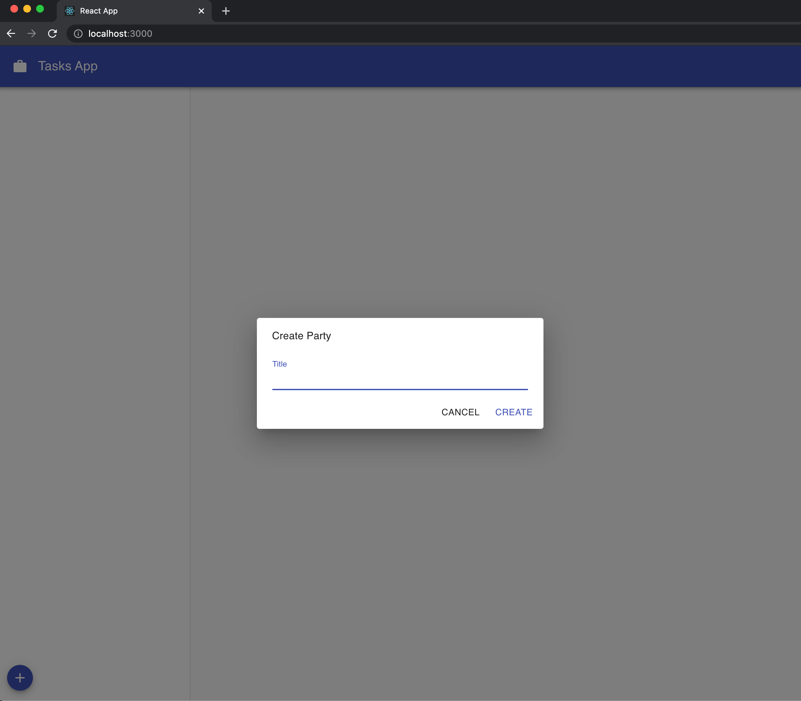
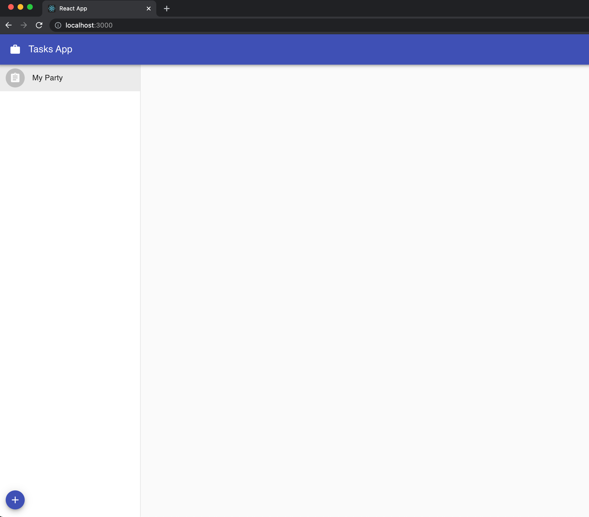
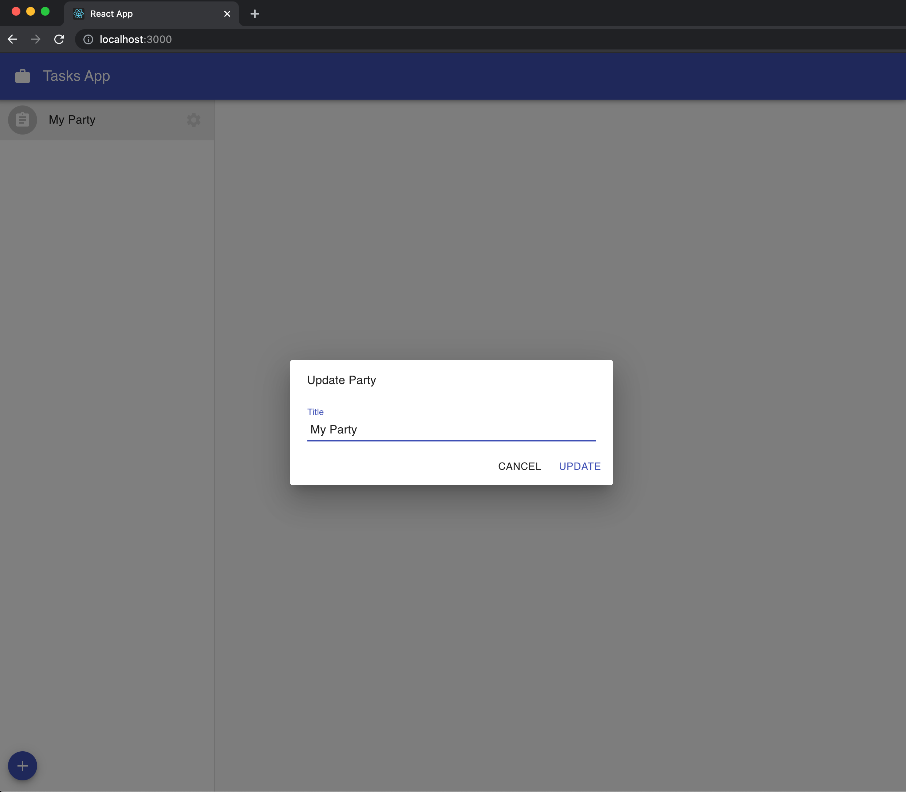

DXOS applications store realtime data within secure ECHO database instances called parties.

Parties can be shared between users and applications synchronize updates to parties in real time across the peer-to-peer MESH network.

## Create a Party

In this example, each Party will represent a Task List that we'll share and invite other peers to collaborate on.

Party creation is handled through the `client.echo` object. After creating the party, we need to set the title property through the `setProperty` function.

Let's create a new dialog component to handle this logic:

```jsx:title=src/components/PartySettings.js
import { useClient } from '@dxos/react-client';

const PartySettings = ({ space_key = undefined, onClose }) => {
  const client = useClient();
  const [title, setTitle] = useState('');

  const handleSubmit = async () => {
    const party = await client.echo.createParty({ title });
    await party.setProperty('title', title);
    onClose();
  };

  return <Dialog />;
};
```

> You can access [this](https://github.com/dxos/tutorial-tasks-app/blob/master/src/components/PartySettings.js) link to get the code of `Dialog`.

Now, create a `PartyList` with a button to open the dialog (we will later display the created parties here):

```jsx:title=src/components/PartyList.js
import { useParties } from '@dxos/react-client';

import PartySettings from './PartySettings';

const PartyList = ({}) => {
  const [{ settingsDialog }, setSettingsDialog] = useState({});

  const handleCreateParty = () => setSettingsDialog({ settingsDialog: true });

  return (
    <div>
      {settingsDialog && <PartySettings onClose={() => setSettingsDialog({})}/>}

      <div>
        <Fab size='small' color='primary' aria-label='add' title='Create list' onClick={handleCreateParty}>
          <AddIcon />
        </Fab>
      </div>
    </div>
  );
};
```

Finally, create a [`Main`](https://github.com/dxos/tutorial-tasks-app/blob/master/src/components/Main.js) component to give our app some layout.

> - At this point, we haven't created the `TaskList` component yet. Therefore, you can skip this import by now commenting out its respective codes;
> - If you face any problem with `confirm()` function, you can try using `window.confirm()`.

Go to your `src/components/Root.js` and render the `Main` component on the created profile section.

If you go to your app in the browser, you should be able to open the dialog and create a new party:



## Fetch Parties

You may have realized that even though we are able to create a party, there's no way to see it yet. So let's make it happen.

We can fetch all the created Parties using the `useParties` hook provided by `@dxos/react-client`.

```jsx:title=src/components/PartyList.js
import { useParties } from '@dxos/react-client';

const PartyList = ({}) => {
  const parties = useParties();

  // ...

  return (
    <div>
      {/* ...  */}

      <List disablePadding>
        {parties.map((party) => (
          <ListItem button key={party.key}>
            <ListItemText primary={party.getProperty('title')} />
          </ListItem>
        ))}
      </List>

      {/* ... Fab Button  */}
    </div>
  );
};
```

You should now be able to see your created party. You can add your own icons and styling to the list.



## Fetch Single Party

Now that we have our party created and listed, let's add the possibility to update its name. For that to happen, we will slightly tweak our `PartySettings` dialog to also support modification apart from creation.

Take a look at the code below, we are using the `useParty` hook to be able to just fetch a single party:

```jsx:title=src/components/PartySettings.js
import { useClient, useParty } from '@dxos/react-client';

const PartySettings = ({ space_key = undefined, onClose }) => {
  const client = useClient();
  const party = useParty(space_key);

  const [title, setTitle] = useState(party ? party.getProperty('title') : '');

  const handleSubmit = async () => {
    if (party) {
      await party.setProperty('title', title);
    } else {
      const party = await client.echo.createParty({ title });
      await party.setProperty('title', title);
    }

    onClose({ space_key });
  };

  return <Dialog />;
};
```

You are going to need to add a button to each party to trigger the dialog and send the `space_key` of the selected party to the `PartySettings` dialog.

```jsx:title=src/components/PartyList.js
import { useParties } from '@dxos/react-client';

const PartyList = ({ onSelectParty }) => {
  const [{ settingsDialog, settingsspaceKey }, setSettingsDialog] = useState({});

  const parties = useParties();

  // ...

  return (
    <div>
      {settingsDialog && <PartySettings space_key={settingsspaceKey} onClose={() => setSettingsDialog({})} />}

      <List disablePadding>
        {parties.map((party) => (
          <ListItem button key={party.key} onClick={() => { onSelectParty(party.key) }}>
            <ListItemText primary={party.getProperty('title')} />

            <ListItemSecondaryAction className='actions'>
              <IconButton
                size='small'
                edge='end'
                aria-label='settings'
                title='Settings'
                onClick={() => setSettingsDialog({ settingsDialog: true, settingsspaceKey: party.key })}
              >
                <SettingsIcon />
              </IconButton>
            </ListItemSecondaryAction>
          </ListItem>
        ))}
      </List>

      {/* ... Fab Button  */}
    </div>
  );
};
```


