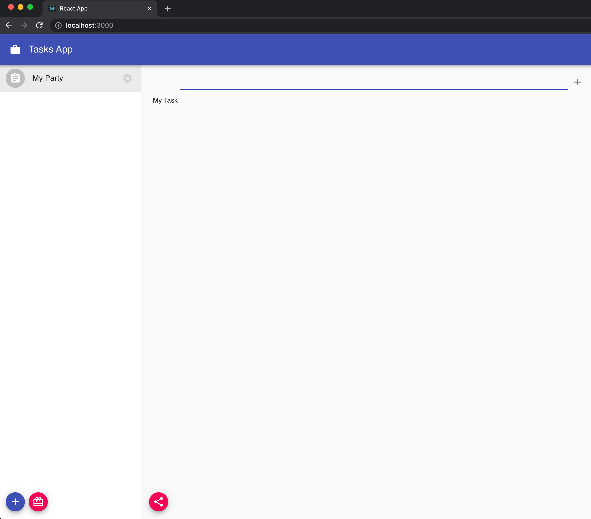

## List items

We should add now some more code to be able to see the created tasks. For this we will use the `useSelection` hook provided by `@dxos/react-client` that will allow us to filter items by some criteria:

```jsx:title=src/components/TaskList.js
import { ObjectModel } from '@dxos/object-model';
import { useParty, useSelection } from '@dxos/react-client';

const TASK_TYPE = 'example.com/type/task';

const TaskList = ({ partyKey }) => {
  const party = useParty(partyKey);

  const items = useSelection(
    party.database.select(
      selection => selection.filter({ type: TASK_TYPE }).filter((item) => !item.model.getProperty('deleted')).items
    ),
    [partyKey]
  );

  // ...

  return (
    <div>
      <List dense>
        {/* ... Creation Input */}

        {items.map((item) => (
          <ListItem button key={item.id}>
            <ListItemText primary={item.model.getProperty('title')} />
          </ListItem>
        ))}
      </List>

      {/* ... Share Button */}
    </div>
  );
};
```

Check again your browser, you should now see your created tasks.


