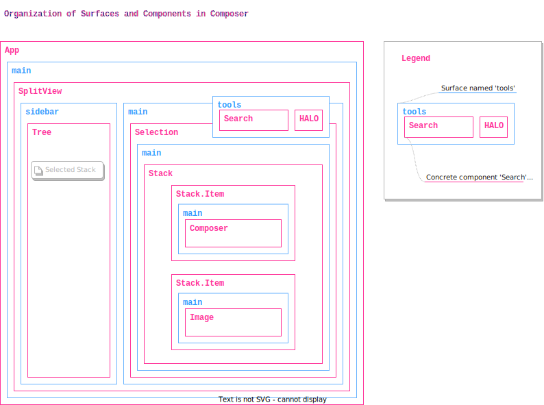

# Composer

A developer-first, peer-to-peer knowledge management system (KMS).

## Iteration history

- `zhenya-0` proposed a static (v1) vs dynamic (v2) chrome paradigm.
- `rich-0` proposed Surfaces, ECHO-bound Frames and embraced the dynamic chrome paradigm, getting ahead of `zhenya-0` in terms of flexibility.
- `zhenya-1` (this version) embraces Surfaces, is ahead of `rich-0` in terms of flexibility, but behind `rich-0` in terms of dynamic discovery, loading, installation, and isolation of modular code. This version also decouples from ECHO and replaces `Frames` with regular `React.Component`.

## Scenarios

#### Composer scenarios (production)

1. Users can collaborate on a github issue together
2. Users can work on folders of markdown files in a "stack-editor" paradigm
3. Developers can extend Composer with custom data sources and visual surfaces
4. Developers can visualize the structure of Composer's surfaces and examine metadata about fulfilling components.

#### Additional Kai scenarios (labs)

4. Users can work with email
5. Users can see all notifications in a universal inbox (across email and other sources)
6. Users can make presentations
7. Users can draw together
8. Users can collect lists of contacts
9. Users can manage shared todo lists
10. Users can launch and interact with bots in their spaces
11. Users can play chess together
12. Users can collaborate over kanban boards
13. Users can collaborate over post-boards of notes
14. Users can interact with LLM based agents
15. Users can chat and message with other users

## Goals

1. To provide developers with full control over the interface of their KMS
2. To make it possible for Kai and Composer to share a common application framework
3. To make Composer an easier-to-ship subset of all of Kai's scenarios

## Non goals

1. Isolation of 3p code - all modular code is assumed to be trusted for now, with isolation to be tackled at a later point.
2. Runtime extensibility - for now it's ok to assume all plugins are compiled-in, and later we'll tackle loading and installing them at runtime via ESM.
3. Dynamic discovery and installation of modular UI components - although the design should not preclude this later once runtime extensibility is complete.
4. Central registration in DMG - no dynamic discovery and installation means DMG is not required in this design.
5. Coupling of any part of the application model to ECHO - ECHO will be just one of the sources of state for the application, and therefore the application model should not marry developers to ECHO.

## Definitions

- **Application**: An application built with this framework which can use Surfaces to render components "dynamically" and provides a specific context to all nested components allowing them to access `application state` and list of `loaded plugins`.
- **Component**: A regular react component which can rely on a specific application context while inside the application. Components are free to nest as many Surfaces within them as necessary.
- **Surface**: A way of delegating the concrete presentation of a piece of UI to external plugins. A surface accepts a data context, a set of plugins, and other props which are used to resolve and instantiate concrete components to 'fulfill' that surface. Some surfaces render one component at a time, others can render more than one with a specific layout rule (i.e. stacking them horizontally or vertically).
- **Plugin**: A unit of containment, modularization, and distribution of external/modular functionality that can be dynamically installed into an application (at build time, and later at runtime). Plugins provide things like components and other data to the application.
- **Shell**: The HALO button and generic UI for join and space management flows that appear in popups overtop the main application and hosted in the vault iframe. A subset of the vault UI surface that is restricted to the calling application that saves developers the cost of implementing boilerplate UI flows for space and identity management.
- **Chrome**: All the UI of an application that is not (but surrounds) the user generated content itself. (e.g.: buttons, toolbars, sidebar affordances, dividers, drag handles, ... etc.)
- **Vault**: HALO universal PWA which stores identity and data
- **Stack**: A user experience paradigm (component) which enables editing columns of mixed content with arbitrary (extensible) content types. A key feature is the draggability of stack elements to re-order them.

## Non-definitions

- **Frames**: are not defined because explicit coupling to ECHO is a non-goal, and without that Frames are just regular React Components which can assume certain contexts or props within this application framework. React Components or Components are used in place of Frames from prior art.

## Out of scope

- Distribution (or registration) of Components separately from Plugins. Plugins are the only unit of registration and distribution and contain / provide a list of Components to the host application. To identify a component globally, a string containing the identity of the plugin _and_ the component must be used.

## Applications are made of Surfaces and Components

- The application is a component `<App />`.
- A component can have any number of `<Surface />` as children inside it.
- A Surface figures out what Component(s) to render given a set of `loaded plugins`, a `data context`, and `other control props`. It can be understood as the the developer intention to render/visualize the given `data context` (datum) using whatever appropriate component as provided by Plugins and configured by the the end user and/or the developer.
- The main `<App />` component defines a single, full-screen `<Surface />` for rendering "anything". i.e.: does not opine about what it is, delegates that to plugins and initial configuration entirely.
- The main `<App />` component also wraps the main `Surface` with an `AppContext` provider representing the total and entire state of the application which becomes available through a hook to any nested component.

## Example Structure

Below is a diagram illustrating how:

- a full application is built up to handle a `Stack` of `Composer` and `Image`
- `Surfaces` are the only element of abstraction necessary to both compose the entire application chrome and implement the abstract portion of `Stack`.



## Stacks

- Stacks are just components which rely on the same `<Surface />` concept to delegate the concrete rendering of stack elements to components provided by plugins.

## Routing

- Routing (the main router and top level routes) are declared outside (around) the `<App />` component and allow the `App` to pass route information as state in the total `AppState` context for all descendants.
- Nested components inside `<App />` are equally free to use `<Route />` elements if necessary as well.
- Nested components are encouraged to perform navigation by submitting `Actions` as opposed to calling `navigate()` directly, although situations like `<Button to="/some/route"/>` should also be supported.

## Application State and Actions

- The App provides a global `AppState` (in the `AppContext`) to all nested components which is composed of some concrete and other dynamic sections to be filled by plugins
- State is updated via a `dispatch(...actions)` API in the `AppContext` which enables Plugins to subscribe to each other's actions and update state accordingly
- Plugins (and their provided Components) are free to extend/add more fields to the `AppState` as necessary, when it is desirable to share certain state application-wide.
- State can be composed of `@preact/signals` (or similar reactive state solution) and can contain any other objects including `ECHO` objects.
- When state is:
  - local, ephemeral, per-session: it is managed by signals (and backed by local or session storage as appropriate). i.e. the selection state in a List or Tree is ephemeral and not shared between windows or devices, but may be shared among components and plugins in the application.
  - peer-to-peer, permanent: it is managed by ECHO objects.
- `AppState` includes current route and params in convenient form.
- Actions are handled by functions that resemble `reducers` who should return new state reflecting the action committing, and possibly a list of side-effects which may result in more actions or state updates at a later time. (i.e. performing writes to echo objects in a batch is a side-effect, invoking a github API is a side-effect, etc. whereas the indicator that the app is loading something is a purely new state returned from the reducer)

## Plugins, Components, Actions, and other `provides`

- The application framework consumes a list of plugins (statically compiled-in for now).
- Plugins can provide Components in response to a specific data context: i.e `plugin.provides.component(data: any): React.FC`
- Compoents provided by plugins can assume they have access to the `AppContext` context and hooks, and may submit actions via `AppContext.dispatch(...actions)`.
- Plugins can provide action handlers such as `plugin.handlers.[<action-type>](state, action): { state, effects }` and can react to actions coming from other plugins this way.
- Plugins may provide any number of other data types and APIs which are specific to certain components which may be present in the Application tree at runtime. If a certain component does not exist, then it will not ask for the relevant `provides` from plugins, and they will therefore be inert. (i.e. Plugins provide a `graph` which can be consumed by any number of UI components including the `Tree` which itself is provided by the `TreePlugin` and may represent the entire and total graph built up by all the plugins loaded).

## Example

Below is an example of how the App in the diagram above would be instantiated illustrating how every surface and component comes from a plugin (none are statically defined by the App).

```tsx
<App
  plugins={[
    new SplitViewPlugin(), // provides SplitView with sidebar, main, tools surfaces
    new TreePlugin(), // provides Tree and Selection which visualize the graph
    new SpacesPlugin(), // provides graph nodes that represent ECHO spaces and their contents
    new StackPlugin(), // provides Stack
    new ComposerPlugin(), // provides Composer
    new ImagePlugin(), // provides Image
    new HaloPlugin(), // provides the HALO button and shell in the tools surface
    new SearchPlugin() // provides the Search element in the tools surface
  ]}
  state={{
    // initial state with which the application state context will be created
    // (or amended during a re-render)
    // e.g.: parsed route and params information from a parent route element goes here
    spaceKey: PublicKey.parse(routeArgs.spaceKey),
    entityId: routeArgs.id,
    // a special area of state declaring the way surfaces are to be given props
    surfaces: {
      // the props to be passed to the main surface
      main: {
        component: 'SplitViewPlugin.SplitView',
        surfaces: {
          sidebar: { component: 'TreePlugin.Tree' },
          tools: {
            component: ['HaloPlugin.HaloButton', 'SearchPlugin.Search']
          },
          main: { component: 'TreePlugin.Selection' }
        }
      }
    }
  }}
/>
```

It should be clear that the entire application structure is constructed based on what is passed in to `state.surfaces` and can therefore be serialized, stored in ECHO, modified by users, or otherwise altered dynamically at runtime.

It's possible for the app to enter a mode where the surface-to-component binding is itself visualized in the `Tree` therefore becoming inspectable and modifiable in-app. It's possible to locate this behavior within yet another plugin (`AppInspectorPlugin` or something).

`Tree` is responsible for rendering all `GraphNodes` provided by plugins, and provides a state to the global `AppState` reflecting the currently selected node(s).

`SpacesPlugin` provides the entire graph in this example, starting with nodes for each ECHO space, followed by subnodes representing queries or specific types, followed by objects of each type.

`Selection` is responsible for sensing what nodes are selected by reading the relevant area in `AppState`, obtaining a reference to the selected `GraphNodes` and the nested ECHO objects they represent, and passing them to a `<Surface />` which knows how to choose the right component to render that ECHO object with.

`StackPlugin` provides a Component that knows how to visualize a given ECHO object of type `stack`, and fulfills the `main` surface of `Selection` dynamically as a result of a `Tree` selection change.

`Stack` components also use `Surfaces` to obtain components from `ComposerPlugin` and `ImagePlugin` which know how to render ECHO objects of type `text` and `image` respectively.

`SearchPlugin` knows how to alter the `surfaces` section of the state such that a different control is presented instead of the `Tree` with flat search results whenever a search term is present in the input box. Alternatively, the `Tree` can equally respond to changes in the search term (global state) and filter itself down accordingly.

## Example Plugins

### Tree Plugin

```tsx
import { HaloButton } from '@dxos/react-shell';
import { Tree } from './Tree';
import { Selection } from './Selection';
import { Plugin } from '@dxos/app-model';

export const TreePlugin: Plugin = {
  meta: {
    id: 'TreePlugin'
  },
  provides: {
    components: {
      HaloButton,
      Tree, // uses AppContext.plugins to grab graph nodes from all plugins
      Selection // uses AppContext.tree.selection to grab ECHO objects in GraphNode.data and <Surface /> them
    }
  }
};
```

### Spaces Plugin

```tsx
import { Plugin } from '@dxos/app-model';

export const SpacesPlugin: Plugin = {
  meta: {
    id: 'SpacesPlugin'
  },
  provides: {
    graph: {
      getNodes(parent, context) { // return a GraphNode with label and lazy children
        const { client } = context;
        return client.getSpaces().transform((space) => ({
          label: humanize(space.key),
          children() { return space.query().transform((object) => ({ /* ... */ })) }
        })); // transformed observable
      }
    }
  }
}
```

## Separation from ECHO

### Non-ECHO graph nodes

Graph nodes are not restricted to being ECHO objects. Examples:

- nodes that represent the default surface-to-component bindings and allow users to configure or swap e.g.: the root `SplitView` for something else with the same (or different) surfaces.
- nodes that represent the filesystem
- nodes that represent entities in GitHub (which are not also represented in ECHO)

### Non-Frame components

Some of the components in the example above can be considered `Frames` because they bind directly to ECHO objects. Examples:

- Composer
- Image
- Stack

Others are not binding directly to ECHO objects, but observe other things, e.g.: only ephemeral elements of `AppState`:

- `Search` binds to `AppState.search.term` or similar
- `HaloButton` binds to nothing (no explicit data context) and invokes the shell when clicked.

n.b.: One could say `HaloButton` binds to a HALO Identity, but that would be the case for an `Avatar` orb component or similar, the `HaloButton` component is parameterless and always calls `useIdentity` internally without requiring data context from the parent, making it trivial to use in any application.
