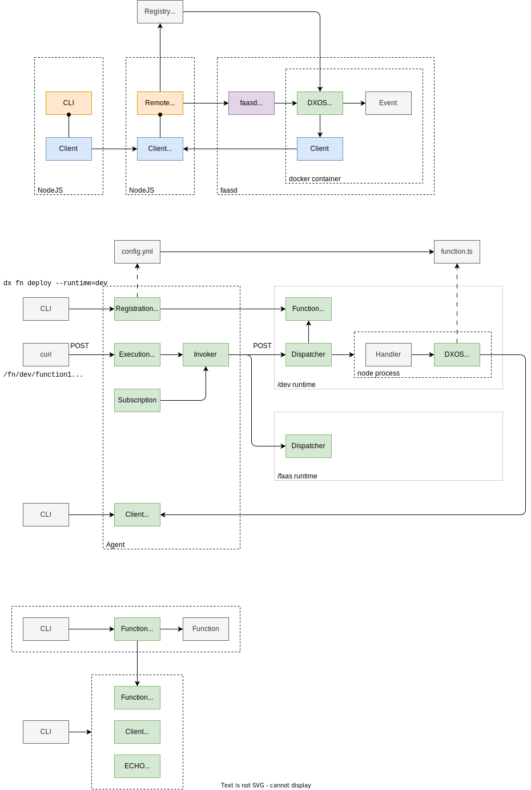

# Remote Agents and Functions

## Overview

> "Your own, personal, Agent. Something to hear your prayers, something that cares."

**Remote Agents** are long-lived peers running on network infrastructure that operate DXOS Client Services and provide runtime APIs.

**Remote Functions** are event-driven functions that have access to a DXOS Client (HALO, Spaces, etc.) connected to a Remote Agent.

> Agents and Functions (capitalized) will refer to these concepts in the rest of this document.

- DXOS applications are inherently peer-to-peer with users intermittently connecting to multiple swarms in order to communicate and share data with other users.
- Users may install service-workers that remain active in the browser (or mobile device) even when individual applications are not active.
- Agents and Functions enable create microservices that are connected to the peer-to-peer network as full peers.

## Use Cases

- **Sync**: If a Space has two members who are not online at the same time then they will not be able to sync with each other.
  Similarly a user with two devices will not be able to sync changes to their HALO (e.g., settings, credentials).
  If either (or both) users deploy an Agent then this acts as a highly available peer that maintains a full replica of the Space.

- **Epochs**: Spaces may designate an Agent to manage Epochs and secure backups. 
  Epochs perform Space compaction and enable long-term state consensus between peers.

- **Universal Search**: Users may enjoin Agents to one or more (or all) of their private and shared Spaces.
  The Agent would maintain replicas of each Space and could create indexes enabling universal search (and queries) across all of the user's data.

- **Gateways**:

- **AI**: 

- Run long-lived functions that operate over users' ECHO spaces and interface with external systems.
- Isolation of individual functions.
- Controlled access to resources (e.g., storage, network). Enables "pure" stateless functions.
- Functions triggered by external events (e.g., signaling, HALO/ECHO mutations, timers, other functions).
- Global registration and discovery (DMG) of functions (similar to applications).
- Life cycle management (i.e., install, start, pause, stop, destroy).

- Sync only (encrypted)

## Use Cases

- Backups and epoch management for individual private and shared spaces (auto-provisioned by user/app.)
- Universal search across user's (or groups)'s spaces.
- Local training of LLM over a set of spaces.
- Bridges to external data sources (e.g., Protonmail, Calendar, enterprise SQL database, web crawler, OAuth APIs.)

## Goals

- Reuse of existing open source systems.
- Memory efficient runtime enabling high density.
- Support multiple runtimes (e.g., WASI; potential to run within browser).
- Local testing environment.
- Ability to self-host (e.g., not require require complex K8s infrastructure)

## Non-Goals

- Coordination of functions (or function state) runtime across multiple VMs (i.e., homogenous network).
- Scale-on-demand: Functions run within the context of a deployed agent; it is not expected to support running 100s of function invocations. "Heavy lifting" might be achieved via external systems, which are out of bound.

## Issues

- Access control via KUBE credentials.
- Agent identity (HALO). Agents create credentials that enable either direct control by a user -- or via user's with access to credentials within a Space.
- Agent's with multiple "devices" -- corresponding to multiple VM deployments (enable migration).
- Support for low-spec machines (e.g., Raspberry PI, IoT).
- Access control for inbound events.
- Asynchronous functions (e.g., async external function calls); implement via chaining?
- Security, isolation. 
- KMS (HALO + external keys: e.g., OAuth tokens; token renewal via public DNS endpoint).

## Architecture

### Definitions

- **VM**: Docker machine.
- **Orchestrator**:
  - manages life-cycle of agents and functions.
  - manages agent connectivity (e.g., swarms).
  - controls function invocation via events.
  - monitoring and resource management.
- **Agent**: 
  - DXOS peer (`@dxos/client`) with HALO (identity) and access to Spaces.
  - Context for function invocation.
- **Function**:
  - Short-lived function ("lambda").
  - Invoked with context (Agent, resource APIs) and event.
  - DMG record (module) defines a group of Functions, and their runtime requirements (runtime, resources, versioned APIs, and dependency graph -- which may include other functions.) Module definition includes the CID or the resource bundle.
  - Resources may include "system" services (e.g., storage, network access) and external endpoints (e.g., Local network services like IMAP server, LLM, or remote services like OAuth gateways.)
- **DMG**:
  - Federated registry that enables publishing and discover of functions.
  - Content-addressable graph database; contains dependency graph.
  - Allows for isolated (private) registration, and federation across DXOS ecosystem (via DXN URIs: e.g., `org.dxos/function/universal-indexer`, `com.example/function/llama-training`, `com.example/function/proton-mail-bridge`)

### Schematic

### Research

- OpenFaaS, `faasd`
  - https://docs.openfaas.com/reference/triggers
- Fission.codes (IPVM)
- Fission.io
- Up: https://github.com/apex/up
- Serverless: https://www.serverless.com/framework
- https://aws.amazon.com/blogs/opensource/24-open-source-tools-for-the-serverless-developer-part-1

## Model

- Personal Agent (HALO device)
- Joins all spaces; appears as user (or avatar)
- Personal store
- ISSUE: Run on remote machine?
- ISSUE: Epoch anchor in Ethereum (labs)
- ISSUE: Epoch leadership election with partitioned network
