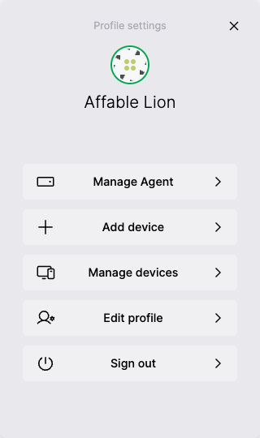
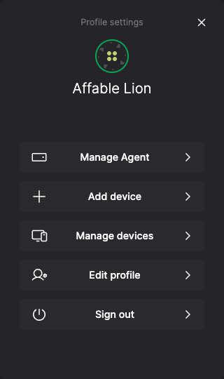
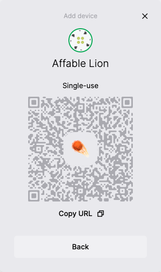
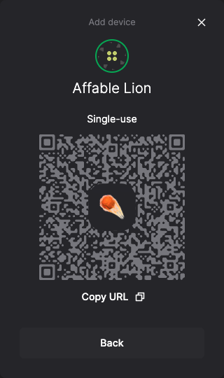

---
dir:
  text: HALO Identity
  order: 4
order: 1
---

# HALO Identity

HALO is a system of components for implementing decentralized identity designed around privacy, security, and collaboration requirements.

* The HALO **Shell** manages the user's identity and connected devices. It's available as a [component](https://github.com/dxos/dxos/tree/main/packages/sdk/shell).
* The HALO [**SDK**](https://www.npmjs.com/package/@dxos/client) is part of the DXOS client library and provides user authentication, identity, and contact management capabilities.
* The HALO **protocol** supports the verification, transport, and exchange of identity information between networked peers.

## Background

See the user guide's [section on identity](../../composer/user-guide/).

## Features

* Public/private key-pair authentication mechanism integrated into ECHO
* Passwordless log in
* Local-first credentials and key storage
* Multi-device synchronization of identities, credentials, ECHO spaces

## Establishing user identity

There are two ways a user can establish their identity (login) with DXOS on any given [device](../glossary.md#device).

1. Visiting any DXOS-powered application in the browser will immediately initialize a HALO identity for the user.
2. Accepting a [device invitation](#device-invitations) will synchronize the user's identity from another device.

In the future, we plan to support recovering an identity using a [seed phrase](../glossary.md#seed-phrase), sometimes referred to as paper key recovery.

## Shell

Shell is a set of components and pre-built workflows for managing, invitations, identity, and [ECHO](../echo/) spaces.

It's used in Composer and looks like a full screen dialog panel:

  
  

  
  

Shell is also available for use by non-Composer applications. You can see the Shell package itself [here on GitHub](https://github.com/dxos/dxos/tree/main/packages/sdk/shell). It runs and renders within an iframe managed by the DXOS client.

The shell can be invoked via the client API.

Scenarios:

* View and edit the user's basic profile
* Invite someone to a space
* Accept an invitation to join another space
* Join another device to the user's HALO identity
* Accept a device invitation to join the current device to an existing HALO identity

You can experiment with the Shell at <https://halo.dxos.org>.

## Next steps

How to use the HALO Shell in code:

* Use [Shell with Typescript](../echo/typescript/)
* Use [Shell with React](../echo/react/)

How to read the HALO identity in code:

* Use the [`useIdentity` hook in react](../halo/react.md)
* Use the [`client.halo.profile` field in TypeScript](../halo/typescript.md)
