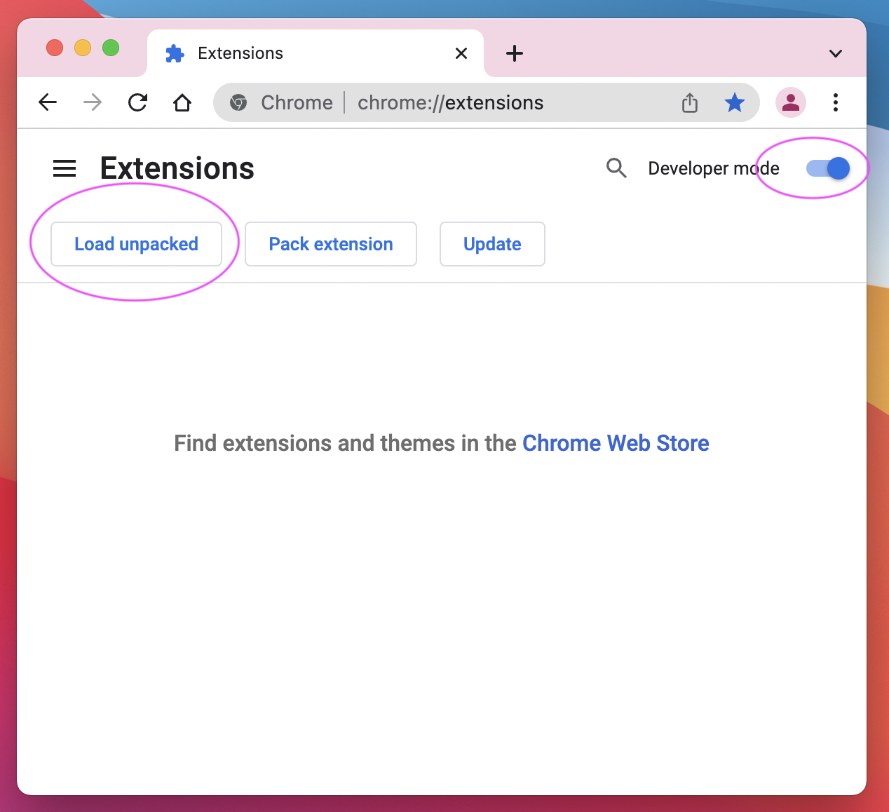
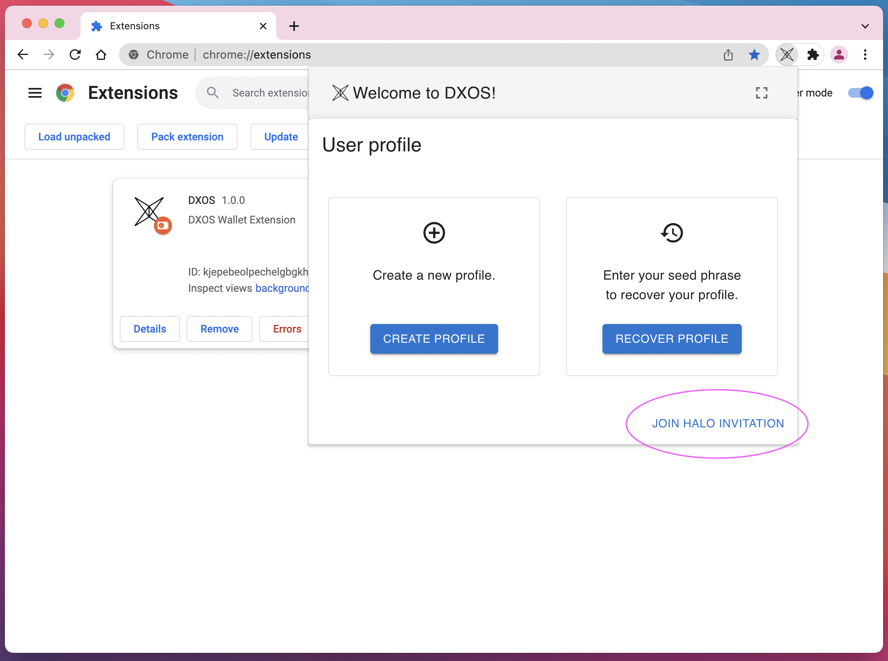
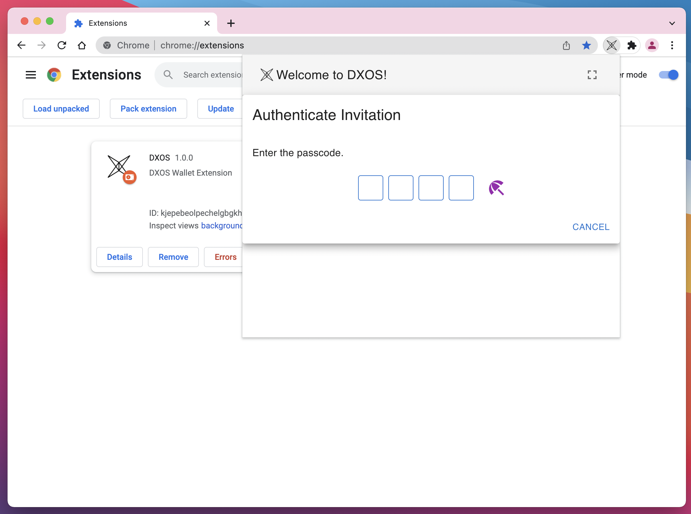

# Developer Environment Setup

DXOS provides two developer tools that will help us while we are working with the DXOS stack. These tools are the CLI and the Devtools web extension. In this section we will walk through how to install and setup those tools.

## Install CLI

You can install the CLI globally using your favorite package manager, here we will use `yarn`:

```bash
yarn global add @dxos/cli
```

Once the CLI is installed you should be able to run the following to see the version you installed:

```bash
dx version
```

## Setup Identity

Profiles contain configuration for connecting with various DXOS services, allowing you to connect to specify which service provider you wish to use and quickly switch between them.

CLI commands related to CLI profiles begin with: `dx profile`.
The profiles are stored in a form of `.yml` files in `~/.dxos/profile`.

You can initialize our default profile with the following command:

```bash
dx profile init --name devnet --template-url https://bit.ly/3M37HBT
```

Once the profile has been initialized, set it as the current profile:

```bash
dx profile set devnet
```

## Setup HALO

The HALO protocol manages digital identity, collaboration, and access to applications, databases, and network devices. The HALO keychain works across devices and is seamlessly integrated into all DXOS applications.

CLI commands related to CLI profiles begin with: `dx halo`.
The permanent storage of HALO is stored in `~/.dx/storage`.

You can initialize a new HALO identity with the following command:

```bash
dx halo init --name devnet
```

Once HALO has been initialized, it is set as default automatically.

## Extensions

The CLI has extensions which can be installed based on your needs. In this section we will make use of the DXNS extension, which can be installed by running the following:

TODO link to cli extensions

```bash
dx extension install @dxos/cli-dxns
```

## Devtools

Similar to React, DXOS has a devtools web extension. The devtools are not required to use DXOS or complete this tutorial but they will give extra insight into what is going on under the hood as you delve deeper into the DXOS ecosystem.

You can download a copy of the extension using the following command:

```bash
dx devtools download --from `dx dxns record get dxos:file.devtools --json | jq -r .data.hash`
```

This will download a zip file which can be [loaded as an unpacked extension](https://developer.chrome.com/docs/extensions/mv3/getstarted/#unpacked) to any Chromium-based browser.

TODO: Link to devtools overview

## HALO Wallet

The HALO Identity can be used in the browser environment, using the [HALO Wallet](https://github.com/dxos/protocols/tree/main/packages/wallet/wallet-extension) extension.

The recent bundle can be downloaded from the [Protocols Releases](https://github.com/dxos/protocols/releases) and loaded in the `chrome://extensions/` page.



### Invite HALO Wallet as a new device

HALO can be shared between different devices, including different CLI instances on different machines and Wallet instances in browser environments.

The Wallet in the browser can join your new HALO profile as a device, through device invitations:

1. In the terminal:

```bash
dx device invite
```

Copy the outputted `code`.

2. Paste the code in the HALO Wallet:



3. Insert the pin taken from the terminal:



#### Troubleshooting

- If the pin code is not showing up, make sure the Wallet and the CLI Identity are connecting to the same Signal Server.