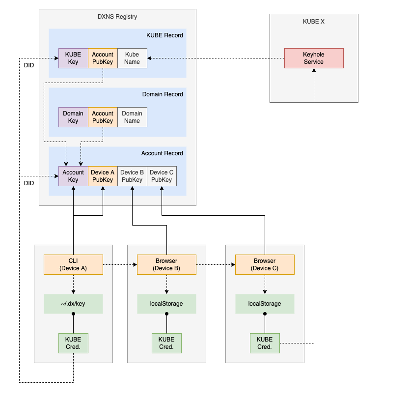
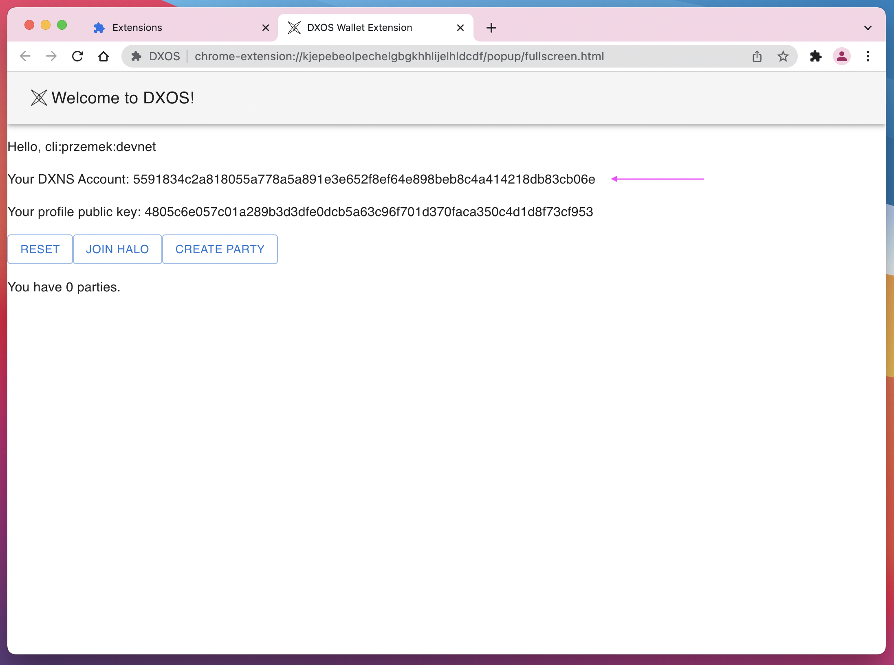
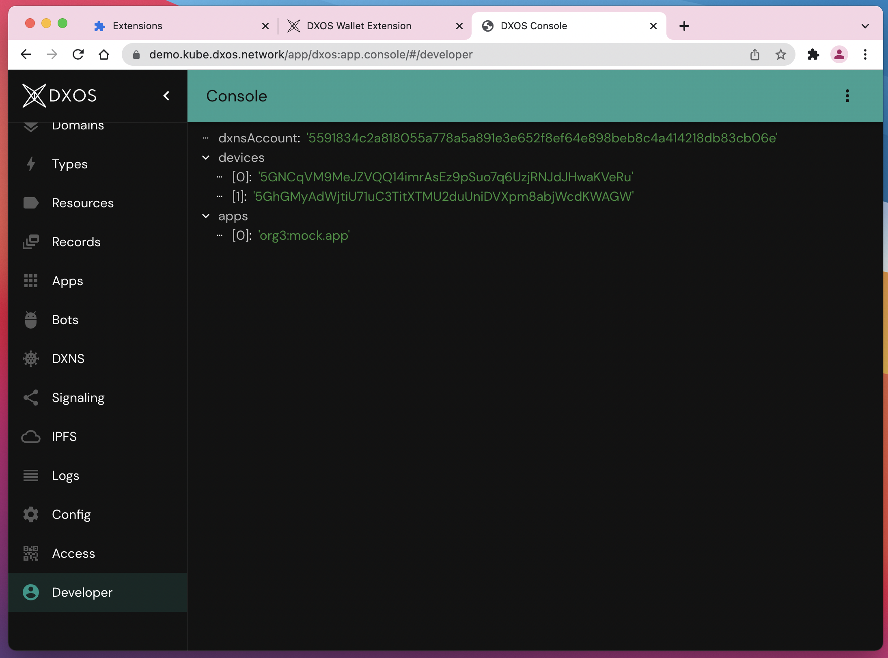

# DXNS Account Devices



A DXNS Account is a blockchain record holding ownership of Domains.
It consist of a list of authorized DXNS Devices - in this context it means a blockchain Addresses.

- A Polkadot Address is specific to a single HALO device
- A DXNS Account can be shared between devices of a HALO identity, and even between different HALO identities

## Adding a device to a DXNS Account

To add a new device, you must know the device's DXNS Address.

For example, create a new HALO identity and address in a new terminal window:

```bash
dx halo init --name device1
dx ns address generate
```

Example output:

```bash
key       value
--------  --------------------------------------------------------------------------------
mnemonic  swap symbol produce shuffle target first surface helmet valve long ensure unique
address   5GhGMyAdWjtiU71uC3TitXTMU2duUniDVXpm8abjWcdKWAGW
```

Don't forget to fund the new address:

```bash
dx ns balance increase --faucet https://node2.devnet.dxos.network/kube/faucet --address 5GhGMyAdWjtiU71uC3TitXTMU2duUniDVXpm8abjWcdKWAGW
```

Go back to the first terminal window we created earlier.
Because the new HALO identity has been made a default, we need to set it back for this terminal session:

```bash
dx halo use devnet
```

Now we can invite the new device to our DXNS Account:

```bash
dx ns account add-device --device 5GhGMyAdWjtiU71uC3TitXTMU2duUniDVXpm8abjWcdKWAGW
```

Check that everything went successfully:

```bash
dx ns account list-devices
```

Output:

```bash
item
------------------------------------------------
5GNCqVM9MeJZVQQ14imrAsEz9pSuo7q6UzjRNJdJHwaKVeRu
5GhGMyAdWjtiU71uC3TitXTMU2duUniDVXpm8abjWcdKWAGW
```

You can invoke `dx ns info` on both terminals to inspect the state of profiles, identities, addresses and accounts.

Example output:

```bash
dx ns info

key           value
------------  ----------------------------------------------------------------
dxnsAddress   5GNCqVM9MeJZVQQ14imrAsEz9pSuo7q6UzjRNJdJHwaKVeRu
dxnsAccount   5591834c2a818055a778a5a891e3e652f8ef64e898beb8c4a414218db83cb06e
haloIdentity  devnet
cliProfile    devnet
```

The second identity is not yet aware that it has been added as a device to our DXNS Account:

```bash
dx ns info

key           value
------------  ------------------------------------------------
dxnsAddress   5GhGMyAdWjtiU71uC3TitXTMU2duUniDVXpm8abjWcdKWAGW
dxnsAccount
haloIdentity  device1
cliProfile    devnet
```

We can manually select the account for all `dx ns` commands using:

```bash
dx ns --account 5591834c2a818055a778a5a891e3e652f8ef64e898beb8c4a414218db83cb06e list

# or:
export DX_DXNS_ACCOUNT=5591834c2a818055a778a5a891e3e652f8ef64e898beb8c4a414218db83cb06e
dx ns info
```


## Deploying an app with the new device

After the new device has been added to the DXNS Account, it has access rights to publish apps with the domain we auctioned earlier.

You can use an example app in the (CLI repository)[https://github.com/dxos/cli] for deployment.

```bash
git clone https://github.com/dxos/cli.git
cd cli/packages/e2e/mocks/app
yarn build

dx ns deploy --domain example --name example.app
```

## Using the Wallet and Console

After the HALO Device invitations to the Wallet, we should see DXNS Account address synced automatically in the Wallet:



With the Wallet, we can go to a public (Console instance)[https://kube.dxos.network/app/dxos:app.console/]. One of the Console purposes is to serve as a blockchain explorer.

On the **Developer** page you should see information about your DXNS Account, the devices, and Apps deployed with this DXNS Account.


