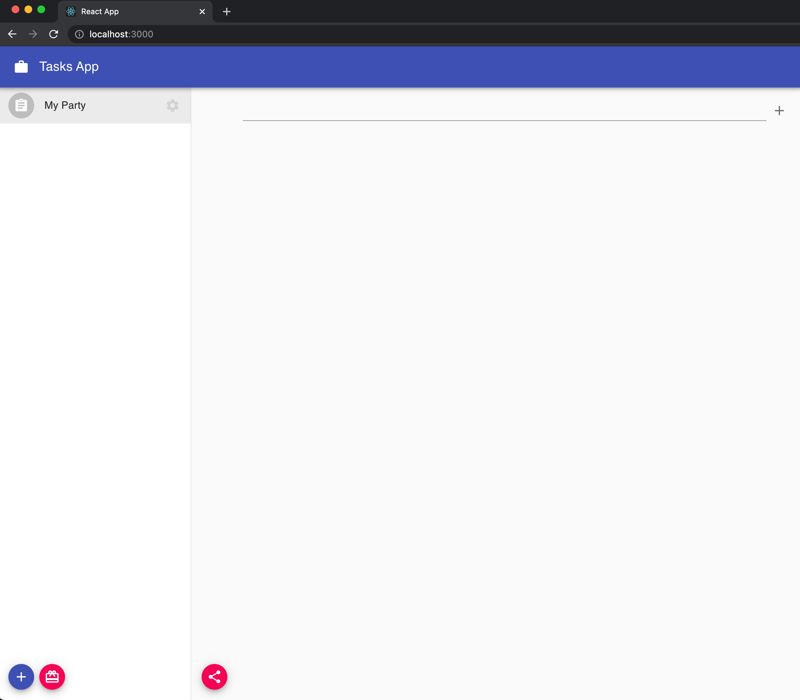

So far, we have been preparing our app to be able to interact with DXOS Stack, but we haven't added any fun logic yet. 
Let's add some more stuff to our `src/components/TaskList.js` file.

## Creating items

On our app the `items` that we are going to create are going to be Tasks. 
Add the following code to your `TaskList` component and take a look at the function `handleCreateItem`. We are calling to `space.database.createItem` function, sending some required information.

```jsx:title=src/components/TaskList.js
import { DocumentModel } from '@dxos/document-model';
import { usespace } from '@dxos/react-client';

const TASK_TYPE = 'example.com/type/task';

const TaskList = ({ space_key }) => {
  const [taskTitle, setTaskTitle] = useState('');

  const space = usespace(space_key);

  const handleCreateTask = async () => {
    await space.database.createItem({
      type: TASK_TYPE,
      model: DocumentModel,
      props: { title: taskTitle },
    });

    setTaskTitle('');
  };

  // ...

  return (
    <div>
      <List dense>
        <ListItem>
          <ListItemIcon />

          <TextField
            fullWidth
            autoFocus
            value={taskTitle}
            onChange={(event) => setTaskTitle(event.target.value)}
            onKeyPress={(event) => event.key === 'Enter' && handleCreateTask()}
          />

          <ListItemSecondaryAction>
            <IconButton size='small' edge='end' aria-label='create' onClick={handleCreateTask}>
              <AddIcon />
            </IconButton>
          </ListItemSecondaryAction>
        </ListItem>
      </List>

      {/* ... Share Button */}
    </div>
  );
};
```

> Uncomment previously commented TaskList component in Main component.

> For now you can create new items but you can't see them. We will implement querying data from the database in the next step.


