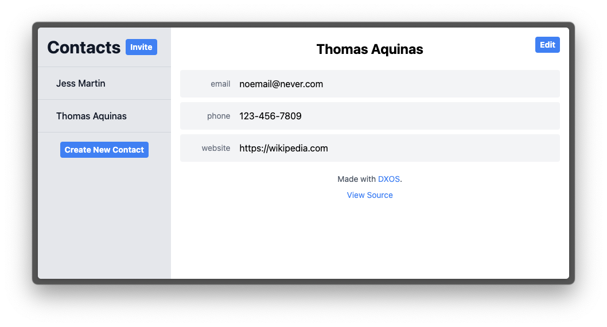
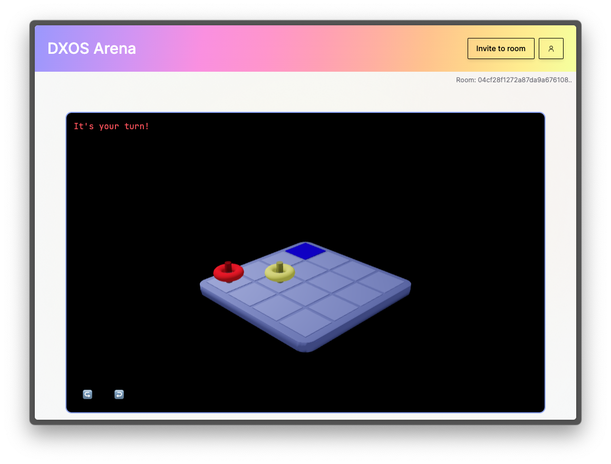

## Apps

### Composer

A local-first workspace that is designed for small team collaboration.

* Learn more about [Composer](https://dxos.org/composer)
* Try [Composer](http://composer.space)
* Code on [Github](https://github.com/dxos/dxos/tree/main/packages/apps/composer-app)

### Tasks

A simple tasks app.

* Code on [Github](https://github.com/dxos/dxos/tree/main/packages/apps/tasks)
* Run [Tasks](http://tasks.dxos.network) on `dxos.network`
  

### TodoMVC

A fork of the [TodoMVC](https://todomvc.com/) sample.

* Code on [Github](https://github.com/dxos/dxos/tree/main/packages/apps/todomvc)
* Run [TodoMVC](http://todomvc.dxos.network) on `dxos.network`
  

### Contacts

Simple contacts manager.

* Code on [Github](https://github.com/dxos/contacts-app)
* Run [Contacts](http://contacts.dxos.network) on `dxos.network`
  

### Game Arena

Collaborative game arena featuring Chess and 3D Connect 4.

* Code on [Github](https://github.com/dxos/arena-app)
* Play [Arena](http://arena.dxos.network) on `dxos.network`
  
