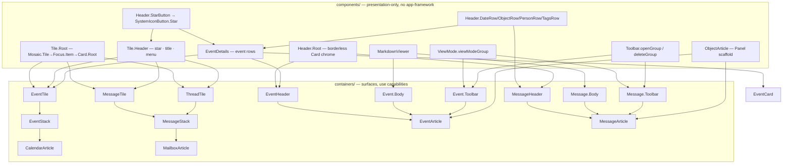

# Inbox shared components — factoring Event/Message into common primitives

Date: 2026-06-15
Plugin: `packages/plugins/plugin-inbox`

## Goal

`plugin-inbox` renders two parallel object families:

- **Mailbox + Message** → surfaces `MailboxArticle` (MessageStack + MessageTile + ThreadTile) and `MessageArticle`.
- **Calendar + Event** → surfaces `CalendarArticle` (EventStack + EventTile) and `EventArticle`.

`CalendarArticle` mirrors `MailboxArticle`; `EventArticle` mirrors `MessageArticle`. Prior work already
shares the star (`Header.StarButton` → `SystemIconButton.Star`), the read-only `MarkdownViewer`, the
`viewModeGroup` toolbar dropdown, and the `EventDetails` row fragment. This change factors out the
remaining duplicated structure so the two families share one set of presentation primitives:

1. A common **Tile root** for `EventTile`/`MessageTile`/`ThreadTile` carrying `SystemIconButton.Star`.
2. A common **article layout** + **header chrome** shared by `EventArticle`/`MessageArticle`.
3. Common **toolbar operation groups** (shared menu builder fns) beyond `viewModeGroup`.
4. Removal of the bespoke **`InboxSettings`** surface in favour of the generic settings form surface.

Non-goals: changing ECHO schema, sync/extraction behaviour, or the operations themselves. This is a
presentation-layer refactor; observable behaviour is preserved (the only intentional change is that the
event star is owned by the tile shell rather than `EventDetails`).

## Current state (post-merge of #11830)

Shared today (keep as-is):

- `components/Header/Header.tsx` — `Header.{DateRow,ObjectRow,PersonRow,TagsRow,StarButton}`.
- `components/MarkdownViewer/` — read-only CodeMirror viewer, used by `Event.Body` + `Message.Body`.
- `components/ViewMode/viewMode.ts` — `viewModeGroup`, `ViewMode`, `VIEW_MODE_ICONS`.
- `components/Event/EventDetails.tsx` — event row fragment used by `EventTile`, `EventCard`, `Event.Header`.

Still duplicated (targets):

- **Tile shell** — `EventTile` (in `EventStack.tsx`) inlines `Mosaic.Tile → Focus.Item → Card.Root`;
  `MessageStack.tsx` has a separate `MessageStackTile` shell. No common root.
- **Article scaffold** — `EventArticle` and `MessageArticle` both render
  `Panel.Root.dx-document → Panel.Toolbar → Panel.Content[grid-rows-[auto_1fr]]`, copy-pasted.
- **Header chrome** — `Event.Header` and `Message.Header` each hand-roll the borderless
  `Card.Root border={false} fullWidth classNames='p-1 border-b border-subdued-separator'` + `Card.Body`.
- **Toolbar ops** — `open`/`delete`/`more` builder groups duplicated across `Event/useToolbar.tsx` and
  `Message/useToolbar.tsx`; only `viewModeGroup` is shared.
- **Settings** — `components/InboxSettings/` + a `pluginSettings` surface in `react-surface.tsx`.

## Dependency UML



## What Event and Message have in common (and what differs)

| Concern        | Common                                              | Event-specific                          | Message-specific                                   |
| -------------- | --------------------------------------------------- | --------------------------------------- | -------------------------------------------------- |
| Star           | `SystemIconButton.Star` via `Header.StarButton`     | TagIndex on Calendar                    | TagIndex on Mailbox                                |
| Tile shell     | `Tile.Root` + `Tile.Header` (star·title·menu)       | body = `EventDetails`                   | body = avatar/from/snippet/tags or thread rows     |
| Header chrome  | `Header.Root` (borderless Card + Card.Body)         | rows = `EventDetails(title='heading')`  | subject/sender/objects/tags rows                   |
| Body           | `MarkdownViewer`                                     | description; editable draft via editor  | block selection (enriched/markdown/plain)          |
| Toolbar        | `viewModeGroup`, `openGroup`, `deleteGroup`         | save, more-dropdown wrapping delete     | reply/replyAll/forward, load-images, extract       |
| Article layout | `ObjectArticle` (Panel scaffold)                    | viewport wraps body in ScrollArea       | body rendered directly in content grid             |
| People         | `Header.PersonRow`                                  | attendees                               | sender (To/CC/BCC TODO)                            |
| Relations      | `Header.ObjectRow`                                  | linked Meeting (handshake button)       | extracted objects (Trip/Person/…)                  |
| Tags           | `Header.TagsRow`                                     | —                                       | Gmail labels + user tags                           |

## Component specs

### 1. `components/Tile/Tile.tsx` (new)

Presentation-only namespace, no app-framework deps. Replaces the inlined `EventTile` shell and
`MessageStackTile`.

- `Tile.Root` — `forwardRef`, props `{ id, data, location, current, onCurrentChange, onClick?, classNames?, children }`.
  Renders `Mosaic.Tile asChild classNames={TILE_CLASSNAMES} → Focus.Item asChild → Card.Root fullWidth border={false}`.
  `TILE_CLASSNAMES = 'dx-hover dx-current dx-selected p-1 rounded-md border border-subdued-separator'`
  (moved here from both stacks; single source).
- `Tile.Header` — props `{ starred?, onToggleStar?, title: ReactNode, menu?: boolean }`. Renders
  `Card.Header` with `Card.Block` › `Header.StarButton`, a `Card.Title` slot for `title`, and `Card.Menu`
  when `menu` (default `false`). The star renders only when `onToggleStar` is set (matching `Header.StarButton`).

Consumers:

- `EventTile` → `Tile.Root` › `Tile.Header(star, title=event title)` + `Card.Body` › `EventDetails(title=false, maxAttendees=8)`.
- `MessageTile` → `Tile.Root` › `Tile.Header(star, title=subject·date, menu)` + `Card.Body` › avatar/from/snippet/`Header.TagsRow`.
- `ThreadTile` → `Tile.Root` › `Tile.Header(star, title=subject)` + `Card.Body` › per-message rows.

Behavioural change: the **event star moves from `EventDetails` into `Tile.Header`** so both tile types
own the star in the shell. `EventDetails` keeps rendering the star only on the article-header path
(`title='heading'`); the tile path passes `title={false}` and no longer renders a star row.

### 2. `Header.Root` (added to `components/Header/Header.tsx`)

`Header.Root` — props `ThemedClassName<PropsWithChildren<{ 'data-testid'?: string }>>`. Renders the
shared chrome:

```tsx
<Card.Root border={false} fullWidth classNames={mx('p-1 border-b border-subdued-separator', classNames)} {...}>
  <Card.Body>{children}</Card.Body>
</Card.Root>
```

`Event.Header` → `<Header.Root classNames={editable && 'gap-y-1'}><EventDetails title='heading' …/></Header.Root>`.
`Message.Header` → `<Header.Root data-testid='message-header'>…subject/sender/object/tags rows…</Header.Root>`.

`data-testid` and `classNames` must forward (the `MessageArticle` play test queries `message-header`,
`extracted-tags`, `message-tag-*`).

### 3. `components/ObjectArticle/ObjectArticle.tsx` (new)

Presentation-only (composes `Panel` from `@dxos/react-ui`, no app-framework). Props
`{ role, toolbar: ReactNode, header: ReactNode, children: ReactNode }`:

```tsx
<Panel.Root role={role} className='dx-document'>
  <Panel.Toolbar asChild>{toolbar}</Panel.Toolbar>
  <Panel.Content className='grid grid-rows-[auto_1fr]'>
    {header}
    {children}
  </Panel.Content>
</Panel.Root>
```

`EventArticle` and `MessageArticle` keep their own capability hooks/handlers and render through
`ObjectArticle`, passing `Event.Toolbar`/`Message.Toolbar` as `toolbar`, the header element as `header`,
and the body region (Event wraps `Event.Body` in `Event.Viewport`; Message renders `Message.Body`
directly) as children.

### 4. `components/Toolbar/toolbar.ts` (new)

Shared menu-builder group fns mirroring `viewModeGroup`'s `ActionGroupBuilderFn` shape:

- `openGroup({ ns, onOpen, disabled? })` — the `open` action (`ph--arrow-square-out--regular`).
- `deleteGroup({ ns, onDelete })` — the `delete` action (`ph--trash--regular`).

Both `useToolbar` hooks compose these via `.subgraph(...)`. The Event toolbar continues to wrap its
delete inside a `more` dropdown (`moreGroup` may wrap `deleteGroup`, or Event keeps its inline `more`
group calling the shared delete label). Reply/replyAll/forward/load-images/extract stay in
`Message/useToolbar.tsx`; save stays in `Event/useToolbar.tsx`. Contributed `graphActions` wiring and the
`nodeId = Obj.getURI(event)` behaviour from #11830 are preserved.

Translation keys: `open`/`delete` labels are currently per-family (`event-toolbar-open.menu`,
`message-toolbar-open.menu`, etc.). The shared groups take `ns` + explicit label keys so existing keys
are reused (no translation churn); the builder fns accept the label tuples as params.

### 5. Remove `InboxSettings`

- Delete `components/InboxSettings/` (component + barrel) and its `#components` export.
- Remove the `pluginSettings` surface entry and `InboxSettings` import from
  `capabilities/react-surface.tsx`.
- **Keep** the settings *store* module in `InboxPlugin.tsx` (`SetupSettings` → `activate: InboxSettings`
  store capability contributing `AppCapabilities.Settings` `{ prefix, schema, atom }`). The generic
  settings form surface in `plugin-settings` renders it from the schema automatically (verified pattern;
  see composer-plugins skill 2026-05-31 settings notes).
- Drop the now-unused `settings.title` translation key; keep `plugin.name` and other keys.
- Note the name collision: the `InboxSettings` *store* capability (`capabilities/`) is distinct from the
  deleted `InboxSettings` *component*.

## Storybooks

New:

- `components/Tile/Tile.stories.tsx` — `Tile.Root` + `Tile.Header` standalone (star on/off, with/without menu).
- `components/ObjectArticle/ObjectArticle.stories.tsx` — scaffold with stub toolbar/header/body slots.
- `components/Header/Header.stories.tsx` — `Header.Root` chrome with representative rows (none today).

Update (reflect new tile/header/layout wiring):

- `EventStack.stories.tsx`, `MessageStack.stories.tsx` — tiles now via `Tile.*`.
- `Event.stories.tsx`, `Message.stories.tsx` — `Header.Root`-based headers.
- `MailboxArticle.stories.tsx`, `CalendarArticle.stories.tsx`, `MessageArticle.stories.tsx`,
  `EventArticle.stories.tsx` (add if missing) — render through `ObjectArticle`.

Story sample data uses real `@dxos/types` schema via `@dxos/schema/testing` generators (per skill memory);
ECHO factories live in `useMemo([], …)`/`render`, never module-level `args`.

## File-level change list

- `src/components/Tile/{Tile.tsx,Tile.stories.tsx,index.ts}` — new.
- `src/components/ObjectArticle/{ObjectArticle.tsx,ObjectArticle.stories.tsx,index.ts}` — new.
- `src/components/Toolbar/{toolbar.ts,index.ts}` — new.
- `src/components/Header/Header.tsx` — add `Header.Root`; `Header.stories.tsx` new.
- `src/components/Header/index.ts` — unchanged (namespace export).
- `src/components/Event/EventDetails.tsx` — drop star on the tile (`title={false}`) path; keep on heading path.
- `src/components/EventStack/EventStack.tsx` — `EventTile` uses `Tile.*`.
- `src/components/MessageStack/MessageStack.tsx` — `MessageTile`/`ThreadTile` use `Tile.*`; delete `MessageStackTile`.
- `src/components/Event/Event.tsx` — `Event.Header` uses `Header.Root`.
- `src/components/Message/Message.tsx` — `Message.Header` uses `Header.Root`.
- `src/components/Event/useToolbar.tsx`, `src/components/Message/useToolbar.tsx` — compose shared `openGroup`/`deleteGroup`.
- `src/components/index.ts` — export `Tile`, `ObjectArticle`, `Toolbar`; drop `InboxSettings`.
- `src/components/InboxSettings/` — delete.
- `src/containers/EventArticle/EventArticle.tsx`, `src/containers/MessageArticle/MessageArticle.tsx` — render via `ObjectArticle`.
- `src/capabilities/react-surface.tsx` — remove `pluginSettings` surface + `InboxSettings` import.
- `src/translations.ts` — drop `settings.title`.

## Testing

- `moon run plugin-inbox:build`, `:lint -- --fix`, `:test`, `:test-storybook` all green.
- Preserve existing play tests (`MessageArticle` queries `message-header`/`extracted-tags`/`message-tag-*`).
- New `Tile`/`ObjectArticle`/`Header.Root` stories get a minimal smoke render; extend the existing
  article/stack suites rather than adding fragmented new suites where one already covers the area.
- Manual: star toggles on both tile types from the shell; article header/toolbar/body render unchanged;
  generic settings form renders for the inbox settings subject.

## Risks / notes

- **Star ownership move** is the only intentional behaviour change — verify the event tile still toggles
  the Calendar TagIndex star (handler unchanged, only its render location moves).
- `Tile.Root`/`Tile.Header`/`ObjectArticle` must stay free of `useCapability*`/`useAppGraph` so they live
  under `components/` and render in storybook without a PluginManager (composer-plugins rule).
- No compatibility re-exports for `MessageStackTile`/`InboxSettings` — update all call sites in this change.
- Keep `data-testid`/`classNames` forwarding through `Header.Root` and `Tile.*` (`composableProps`).
```
