# @dxos/echo-e2e

Browser tests for SDK.

## Dependency Graph

```mermaid
%%{ init: {'flowchart':{'curve':'basis'}} }%%

flowchart LR

%% Classes
classDef def fill:#fff,stroke:#333,stroke-width:1px
classDef root fill:#fff,stroke:#333,stroke-width:4px

%% Nodes

subgraph e2e [e2e]
  style e2e fill:#abcced,stroke:#fff
  dxos/echo-e2e("@dxos/echo-e2e"):::root
  click dxos/echo-e2e "dxos/dxos/tree/main/e2e/echo/docs"
end

subgraph common [common]
  style common fill:#debac2,stroke:#fff
  dxos/crypto("@dxos/crypto"):::def
  click dxos/crypto "dxos/dxos/tree/main/packages/common/crypto/docs"
  dxos/codec-protobuf("@dxos/codec-protobuf"):::def
  click dxos/codec-protobuf "dxos/dxos/tree/main/packages/common/codec-protobuf/docs"
  dxos/feed-store("@dxos/feed-store"):::def
  click dxos/feed-store "dxos/dxos/tree/main/packages/common/feed-store/docs"
  dxos/protocols("@dxos/protocols"):::def
  click dxos/protocols "dxos/dxos/tree/main/packages/common/protocols/docs"
  dxos/rpc("@dxos/rpc"):::def
  click dxos/rpc "dxos/dxos/tree/main/packages/common/rpc/docs"
  dxos/random-access-storage("@dxos/random-access-storage"):::def
  click dxos/random-access-storage "dxos/dxos/tree/main/packages/common/random-access-storage/docs"

  subgraph common-excluded [common-excluded]
    style common-excluded fill:#debac2,stroke:#333,stroke-dasharray:5 5
    dxos/keys("@dxos/keys"):::def
    click dxos/keys "dxos/dxos/tree/main/packages/common/keys/docs"
    dxos/log("@dxos/log"):::def
    click dxos/log "dxos/dxos/tree/main/packages/common/log/docs"
    dxos/async("@dxos/async"):::def
    click dxos/async "dxos/dxos/tree/main/packages/common/async/docs"
    dxos/debug("@dxos/debug"):::def
    click dxos/debug "dxos/dxos/tree/main/packages/common/debug/docs"
    dxos/util("@dxos/util"):::def
    click dxos/util "dxos/dxos/tree/main/packages/common/util/docs"
    dxos/testutils("@dxos/testutils"):::def
    click dxos/testutils "dxos/dxos/tree/main/packages/common/testutils/docs"
  end
end

subgraph echo [echo]
  style echo fill:#b3cae6,stroke:#fff
  dxos/echo-db("@dxos/echo-db"):::def
  click dxos/echo-db "dxos/dxos/tree/main/packages/echo/echo-db/docs"
  dxos/model-factory("@dxos/model-factory"):::def
  click dxos/model-factory "dxos/dxos/tree/main/packages/echo/model-factory/docs"
  dxos/object-model("@dxos/object-model"):::def
  click dxos/object-model "dxos/dxos/tree/main/packages/echo/object-model/docs"
end

subgraph halo [halo]
  style halo fill:#cabade,stroke:#fff
  dxos/credentials("@dxos/credentials"):::def
  click dxos/credentials "dxos/dxos/tree/main/packages/halo/credentials/docs"
  dxos/halo-protocol("@dxos/halo-protocol"):::def
  click dxos/halo-protocol "dxos/dxos/tree/main/packages/halo/halo-protocol/docs"
end

subgraph mesh [mesh]
  style mesh fill:#b3e6c0,stroke:#fff
  dxos/mesh-protocol("@dxos/mesh-protocol"):::def
  click dxos/mesh-protocol "dxos/dxos/tree/main/packages/mesh/mesh-protocol/docs"
  dxos/messaging("@dxos/messaging"):::def
  click dxos/messaging "dxos/dxos/tree/main/packages/mesh/messaging/docs"
  dxos/network-manager("@dxos/network-manager"):::def
  click dxos/network-manager "dxos/dxos/tree/main/packages/mesh/network-manager/docs"
  dxos/protocol-plugin-presence("@dxos/protocol-plugin-presence"):::def
  click dxos/protocol-plugin-presence "dxos/dxos/tree/main/packages/mesh/protocol-plugin-presence/docs"
  dxos/broadcast("@dxos/broadcast"):::def
  click dxos/broadcast "dxos/dxos/tree/main/packages/mesh/broadcast/docs"
  dxos/protocol-plugin-replicator("@dxos/protocol-plugin-replicator"):::def
  click dxos/protocol-plugin-replicator "dxos/dxos/tree/main/packages/mesh/protocol-plugin-replicator/docs"
  dxos/protocol-plugin-rpc("@dxos/protocol-plugin-rpc"):::def
  click dxos/protocol-plugin-rpc "dxos/dxos/tree/main/packages/mesh/protocol-plugin-rpc/docs"
end

%% Links
linkStyle default stroke:#333,stroke-width:1px
dxos/echo-e2e --> dxos/echo-db
dxos/credentials --> dxos/crypto
dxos/credentials --> dxos/feed-store
dxos/credentials --> dxos/mesh-protocol
dxos/mesh-protocol --> dxos/codec-protobuf
dxos/credentials --> dxos/protocols
dxos/protocols --> dxos/codec-protobuf
dxos/echo-db --> dxos/halo-protocol
dxos/halo-protocol --> dxos/protocols
dxos/messaging --> dxos/rpc
dxos/rpc --> dxos/protocols
dxos/model-factory --> dxos/feed-store
dxos/model-factory --> dxos/protocols
dxos/echo-db --> dxos/network-manager
dxos/network-manager --> dxos/credentials
dxos/network-manager --> dxos/messaging
dxos/network-manager --> dxos/protocol-plugin-presence
dxos/protocol-plugin-presence --> dxos/broadcast
dxos/broadcast --> dxos/crypto
dxos/broadcast --> dxos/protocols
dxos/protocol-plugin-presence --> dxos/mesh-protocol
dxos/echo-db --> dxos/object-model
dxos/object-model --> dxos/model-factory
dxos/echo-db --> dxos/protocol-plugin-replicator
dxos/protocol-plugin-replicator --> dxos/mesh-protocol
dxos/echo-db --> dxos/random-access-storage
dxos/echo-db --> dxos/protocol-plugin-rpc
dxos/protocol-plugin-rpc --> dxos/messaging
dxos/protocol-plugin-rpc --> dxos/mesh-protocol
```

## Dependencies

| Module | Direct |
|---|---|
| [`@dxos/async`](../../../packages/common/async/docs/README.md) |  |
| [`@dxos/broadcast`](../../../packages/mesh/broadcast/docs/README.md) |  |
| [`@dxos/codec-protobuf`](../../../packages/common/codec-protobuf/docs/README.md) |  |
| [`@dxos/credentials`](../../../packages/halo/credentials/docs/README.md) |  |
| [`@dxos/crypto`](../../../packages/common/crypto/docs/README.md) | &check; |
| [`@dxos/debug`](../../../packages/common/debug/docs/README.md) |  |
| [`@dxos/echo-db`](../../../packages/echo/echo-db/docs/README.md) | &check; |
| [`@dxos/feed-store`](../../../packages/common/feed-store/docs/README.md) | &check; |
| [`@dxos/halo-protocol`](../../../packages/halo/halo-protocol/docs/README.md) | &check; |
| [`@dxos/keys`](../../../packages/common/keys/docs/README.md) | &check; |
| [`@dxos/log`](../../../packages/common/log/docs/README.md) |  |
| [`@dxos/mesh-protocol`](../../../packages/mesh/mesh-protocol/docs/README.md) |  |
| [`@dxos/messaging`](../../../packages/mesh/messaging/docs/README.md) | &check; |
| [`@dxos/model-factory`](../../../packages/echo/model-factory/docs/README.md) |  |
| [`@dxos/network-manager`](../../../packages/mesh/network-manager/docs/README.md) | &check; |
| [`@dxos/object-model`](../../../packages/echo/object-model/docs/README.md) | &check; |
| [`@dxos/protocol-plugin-presence`](../../../packages/mesh/protocol-plugin-presence/docs/README.md) |  |
| [`@dxos/protocol-plugin-replicator`](../../../packages/mesh/protocol-plugin-replicator/docs/README.md) |  |
| [`@dxos/protocol-plugin-rpc`](../../../packages/mesh/protocol-plugin-rpc/docs/README.md) |  |
| [`@dxos/protocols`](../../../packages/common/protocols/docs/README.md) |  |
| [`@dxos/random-access-storage`](../../../packages/common/random-access-storage/docs/README.md) | &check; |
| [`@dxos/rpc`](../../../packages/common/rpc/docs/README.md) |  |
| [`@dxos/testutils`](../../../packages/common/testutils/docs/README.md) | &check; |
| [`@dxos/util`](../../../packages/common/util/docs/README.md) |  |
