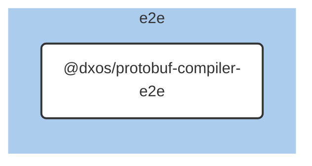

# @dxos/protobuf-compiler-e2e

## Dependency Graph

```mermaid
%%{ init: {'flowchart':{'curve':'basis'}} }%%

flowchart LR

%% Links

%% Sections
subgraph e2e
  style e2e fill:#abcced,stroke:#fff;

  dxos/protobuf-compiler-e2e("@dxos/protobuf-compiler-e2e")
end


%% Hyperlinks

%% Styles
classDef rootNode fill:#fff,stroke:#333,stroke-width:2px
classDef defaultNode fill:#fff,stroke:#333,stroke-width:1px
linkStyle default stroke:#333,stroke-width:1px

dxos/protobuf-compiler-e2e:::rootNode

```

## Dependencies

| Module | Direct |
|---|---|
