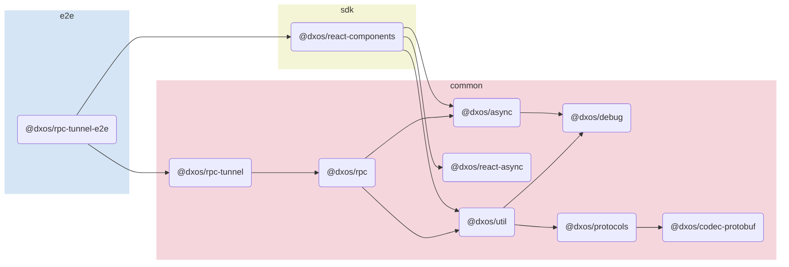

# @dxos/rpc-tunnel-e2e

## Dependency Graph

## Dependencies
| Module | Direct |
|---|---|
| [`@dxos/async`](../../../packages/common/async/docs/README.md) | &check; |
| [`@dxos/codec-protobuf`](../../../packages/common/codec-protobuf/docs/README.md) | &check; |
| [`@dxos/debug`](../../../packages/common/debug/docs/README.md) |  |
| [`@dxos/protocols`](../../../packages/common/protocols/docs/README.md) | &check; |
| [`@dxos/react-async`](../../../packages/common/react-async/docs/README.md) | &check; |
| [`@dxos/react-components`](../../../packages/sdk/react-components/docs/README.md) | &check; |
| [`@dxos/rpc`](../../../packages/common/rpc/docs/README.md) | &check; |
| [`@dxos/rpc-tunnel`](../../../packages/common/rpc-tunnel/docs/README.md) | &check; |
| [`@dxos/util`](../../../packages/common/util/docs/README.md) |  |
