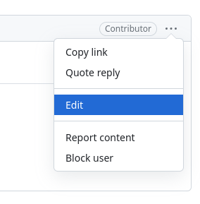
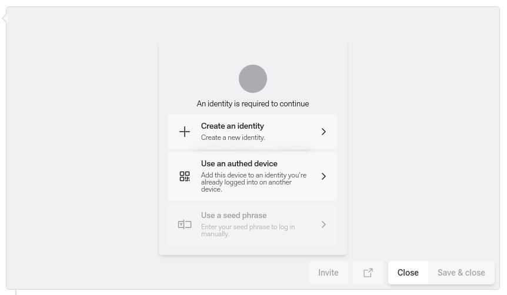
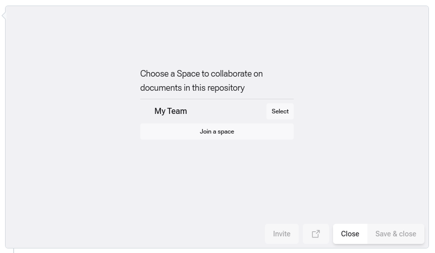
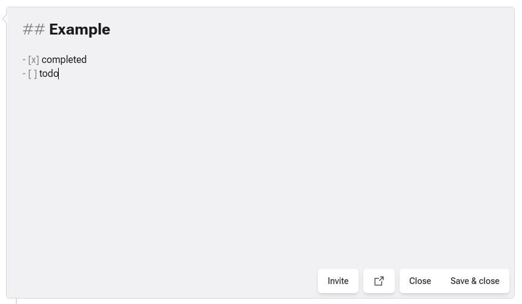
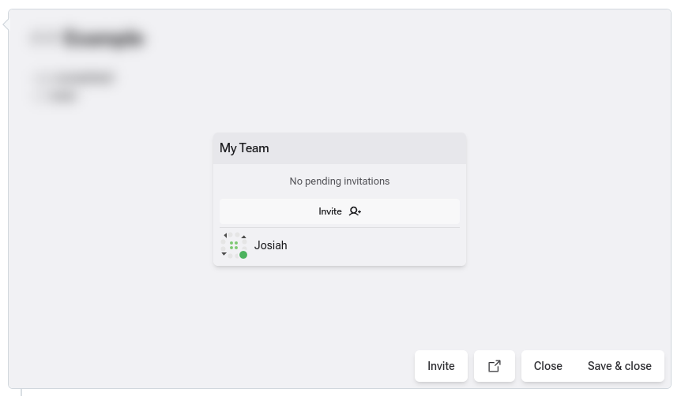
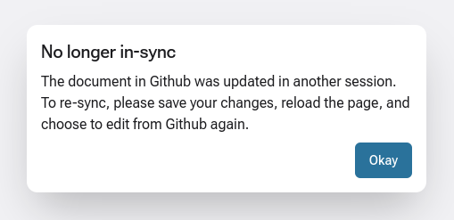

## DXOS Composer Extension Usage

1. Select `Edit` from the `...` menu of the issue.

2. If no identity exists in the current browser profile then one will need to be created.

3. The first time using the extension in a new repo a space will need to be linked. This is the space that will be used to create or load all issues.

4. Once a space is linked the issue will be editable inside the space.

5. In order to edit collaboratively, others need to be invited to the space.

## Troubleshooting

> ⚠️ Caution: if there's an existing document and the issue text has changed elsewhere, the changes will not currently be pushed to composer.

If the issue text changes while editing in composer, saving will fail the same way it does without composer, except that this message will be displayed instead.

The difference when using composer is that edits are persisted in an ECHO db, so reloading won't lose any data.
We will support merging changes from github with composer documents in the future.

## Questions?

Have any questions about how to use the extension or composer? Ideas about ways this could be better? Let us know on Discord https://dxos.org/discord
