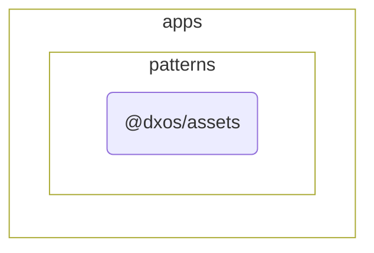

# @dxos/assets

Digital assets.

## Dependency Graph

```mermaid
%%{ init: {'flowchart':{'curve':'basis'}} }%%

flowchart LR

%% Classes


%% Nodes

subgraph apps [apps]
  style apps fill:transparent

  subgraph patterns [patterns]
    style patterns fill:transparent
    dxos/assets("@dxos/assets"):::root
    click dxos/assets "dxos/dxos/tree/main/packages/apps/patterns/assets/docs"
  end
end
```

## Dependencies

| Module | Direct |
|---|---|
