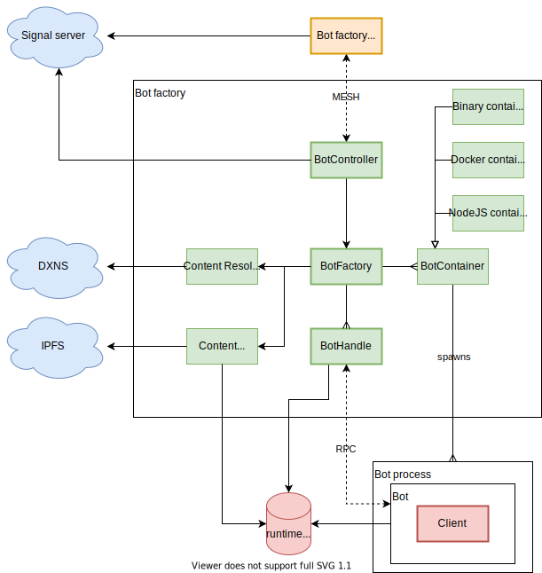

# Bots docs

## Introduction

Bots framework allows you to create a custom DXOS bot and run it on a KUBE, or use and run an already existent one. Bots are human-like peers that can participate in parties, and are generally used to provide some kind of automated service.

## Core concepts

* Bots don't have to, but are designed to contain DXOS client and be invited to a specific party.
* Bots are supposed to be up and running all the time unless explicitly stopped or removed. This also means that in most cases one would want to subscribe to some events in order for bot to be able to provide some service in response to those events.
* Bot factory is a service that manages bots. It is supposed to be run on a KUBE.
* Bundled file with a bot is uploaded to IPFS, and a record representing this bot is created in DXNS. Bot factories are capable of resolving bot records in DXNS and downloading bundles from IPFS.

## Architecture

General bots framework architecture is presented on a diagram below.



BotController is what exposes BotFactory service to the outer world. You can use [BotFactoryClient](bot-factory-client) to connect to and use BotFactory service in your code. To create a BotFactory client in your code you can do:
```typescript
  const topic = config.get('runtime.services.bot.topic');
  assert(topic, 'Topic must be provided');

  const botFactoryClient = new BotFactoryClient(client.echo.networkManager);
  await botFactoryClient.start(PublicKey.from(topic));
```
This will take topic from your client config and try to establish connection to a bot factory specified by this topic. The topic can be found at KUBE's services endpoint (e.g. [https://experimental.kube.dxos.network/kube/services](https://experimental.kube.dxos.network/kube/services)) under bot-factory name of service. Bot factory client and bot factory will be able to connect if they're connected to the same signal server. They communicate using custom [RPC](../common/rpc/). The communication implements [BotFactoryService](../common/proto/src/proto/dxos/bot.proto).
After connection is established, bot factory client will be able to:
* Spawn a new bot. Bot can be defined in 3 ways:
  * DXN - resource identifier in DXNS. Bot factory will automatically fetch the record from DXNS using ContentResolver and get the IPFS CID of the bot bundled file. Next steps are similar as in case of IPFS CID.
  * IPFS CID - hash of the bot bundled file stored in IPFS. Bot factory will automatically download the file to the bot directory created by bot factory.
  * Local path - path to a bot that is stored on the same machine where bot factory is running. Useful in local development.
* Invoke lifecycle methods on a given bot. Available methods are: start, stop, remove. 

Ultimately bot factory will able to spawn bots using different containers, but for now the only available container is Node container. Node container will run a javascript file using the `node` command.

After a bot is spawned, there are two entities that represent it:
* Bot process is a seperate OS process where the bot's code is executed. 
* Bot handle is an object that represents a bot process in the bot factory.
They communicate using custom [RPC](../common/rpc/). The communication implements [BotService](../common/proto/src/proto/dxos/bot.proto).
