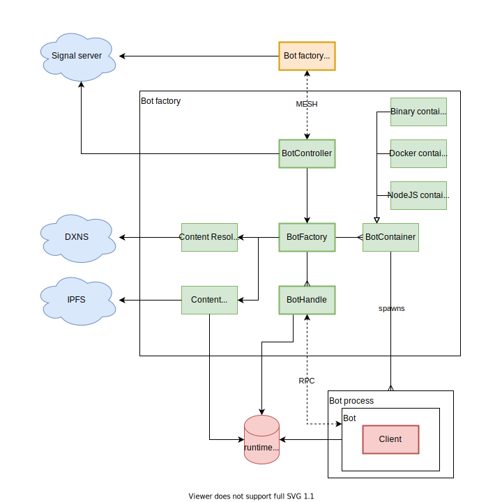

# Bots docs

## Introduction

Bots framework allows you to create a custom DXOS bot and run it on a KUBE, or use and run an already existing one. Bots are human-like peers that can participate in parties, and are generally used to provide some kind of automated service.

## Core concepts

* Bots don't have to, but are designed to contain DXOS client and be invited to a specific party.
* Bots are supposed to be up and running all the time unless explicitly stopped or removed. This also means that in most cases one would want to subscribe to some events in order for bot to be able to provide some service in response to those events.
* Bot factory is a service that manages bots. It is supposed to be run on a KUBE.
* Bundled file with a bot is uploaded to IPFS, and a record representing this bot is created in DXNS. Bot factories are capable of resolving bot records in DXNS and downloading bundles from IPFS.

## Architecture

General bots framework architecture is presented on a diagram below.



BotController is what exposes BotFactory service to the outer world. You can use [BotFactoryClient](bot-factory-client) to connect to and use BotFactory service in your code. To create a BotFactory client in your code you can do:
```typescript
  const topic = config.get('runtime.services.bot.topic');
  assert(topic, 'Topic must be provided');

  const botFactoryClient = new BotFactoryClient(client.echo.networkManager);
  await botFactoryClient.start(PublicKey.from(topic));
```
This will take topic from your client config and try to establish connection to a bot factory specified by this topic. The topic can be found at KUBE's services endpoint (e.g. [https://experimental.kube.dxos.network/kube/services](https://experimental.kube.dxos.network/kube/services)) under bot-factory name of service. Bot factory client and bot factory will be able to connect if they're connected to the same signal server. They communicate using custom [RPC](../common/rpc/). The communication implements [BotFactoryService](../common/proto/src/proto/dxos/bot.proto).
After connection is established, bot factory client will be able to:
* Spawn a new bot. Bot can be defined in 3 ways:
  * DXN - resource identifier in DXNS. Bot factory will automatically fetch the record from DXNS using ContentResolver and get the IPFS CID of the bot bundled file. Next steps are similar as in case of IPFS CID.
  * IPFS CID - hash of the bot bundled file stored in IPFS. Bot factory will automatically download the file to the bot directory created by bot factory.
  * Local path - path to a bot that is stored on the same machine where bot factory is running. Useful in local development.
* Invoke lifecycle methods on a given bot. Available methods are: start, stop, remove. 

Ultimately bot factory will able to spawn bots using different containers, but for now the only available container is Node container. Node container will run a javascript file using the `node` command.

After a bot is spawned, there are two entities that represent it:
* Bot process is a seperate OS process where the bot's code is executed. 
* Bot handle is an object that represents a bot process in the bot factory.
They communicate using custom [RPC](../common/rpc/). The communication implements [BotService](../common/proto/src/proto/dxos/bot.proto).

## Local development

To create a custom DXOS bot, extend Bot class and override necessary methods.
```typescript
  import { Bot } from '@dxos/botkit';

  const log = debug('dxos:bot:echo-bot');

  export class CustomBot extends Bot {
    override async onStart () {
      // ...your code that will be executed when bot starts
    }

    override async onCommand () {
      // ...your code that will be executed when bot receives a command
    }

    override async onStop () {
      // ...your code that will be executed when bot stops
    }
  }
```

In a separate file, you have to create an instance of the bot. This will the entrypoint of your bot. Please use this template:
```typescript
  import { createIpcPort, startBot } from '@dxos/botkit';

  import { CustomBot } from './custom-bot';

  if (typeof require !== 'undefined' && require.main === module) {
    const port = createIpcPort(process);
    void startBot(new CustomBot(), port);
  }
```

This will enable RPC communication between the bot handle and the bot.

Next you have to start a local signal server so later bot factory and bot factory client are visible to each other. Please run the following command in a separate termnial:
```bash
npx @dxos/signal
```

To run the bot you'll need to start a bot factory. Please run the following commands in a separate terminal:
```bash
npm install -g @dxos/cli
dx bot factory install
dx bot factory setup
DEBUG=dxos:bot* dx bot factory start --dev
```
This will start a bot factory with enabled logging to the default output. The topic that the bot factory listens on will be printed in logs. In the code snippet above we start a bot factory with a `--dev` flag. It forces node container to require `@swc-node/register` module, which should be installed and accessible globally. You can achieve this in the following way:
1. Run `npm install -g @swc-node/register`.
2. Grab a path to global `@swc-node/register`. You can achieve this by running `npm list -g` in a terminal, get the appropriate path and add `/node_modules` to the end.
3. Add the path from the previous step to the `NODE_PATH` variable and export it as an environment variable.

Example:
```bash
➜ npm list -g
/Users/username/.nodenv/versions/16.1.0/lib
├── @swc-node/register@1.4.2
├── node-pre-gyp@0.17.0
├── npm@7.11.2
➜ export NODE_PATH=/Users/username/.nodenv/versions/16.1.0/lib/node_modules
```

To spawn a bot in a local development mode you need to create a party and open first:
```bash
dx party create
dx party open
```

This will enter the the interactive mode in the cli. From now on all commands will be executed in context of the party. For instance bot spawned will be automatically invited to the party:
```bash
bot spawn --localPath /path/to/custom-bot/entrypoint
```

The bot should be up and running after this step - the effects of the code in methods `onStart`, `onCommand` and `onStop` should be visible. You should also be able access the bot via lifecycle methods:
```bash
bot list
bot stop [botId]
bot start [botId]
bot remove [botId]
```

## Deploy

When your bot is ready, you can deploy it to DXNS to make it acccessible for bot factories on the KUBEs. You can do it in three steps:
1. Build.
2. Publish.
3. Register.

### Build

In a terminal, run
```bash
dx bot build --entryPoint /path/to/custom-bot/entrypoint --outfile /path/to/outfile
```
This should create a file `/path/to/outfile`, which contains a bundled bot.

### Publish

In this step we'll publish file created in a previous step to IPFS. To do this, go to the directory where the file is placed. Here create a file named `bot.yml` using this template:
```yaml
name: Bot
description: Bot description
version: 1.0.0
```
Replace default name, description and version with relevant info. Next in the same directory run:
```bash
bot publish --buildPath /path/to/outfile
```

### Register

In this step we'll register the bot in DXNS. In the same directory as in previous step, run:
```
bot register --name BOT_NAME --domain BOT_DOMAIN
```
After this, bot resource will be available under DXN BOT_DOMAIN:BOT_NAME. It should also be accessible for bot factories.

---
**NOTE**

In order to register a bot, you have to own a domain BOT_DOMAIN and enough funds on your DXNS balance.

---
