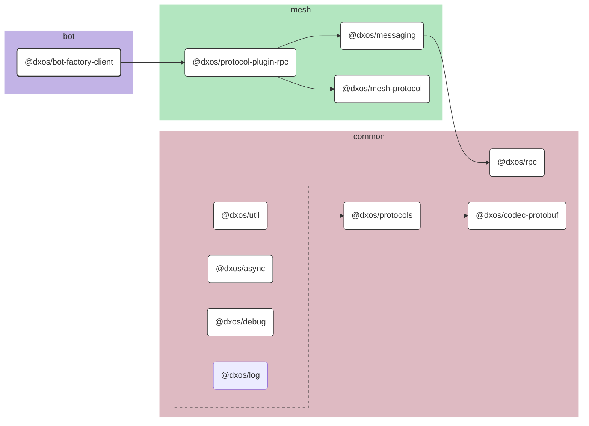

# @dxos/bot-factory-client

Bot

## Dependency Graph

## Dependencies

| Module | Direct |
|---|---|
| [`@dxos/async`](../../../common/async/docs/README.md) | &check; |
| [`@dxos/codec-protobuf`](../../../common/codec-protobuf/docs/README.md) | &check; |
| [`@dxos/debug`](../../../common/debug/docs/README.md) |  |
| [`@dxos/mesh-protocol`](../../../mesh/mesh-protocol/docs/README.md) |  |
| [`@dxos/messaging`](../../../mesh/messaging/docs/README.md) |  |
| [`@dxos/protocol-plugin-rpc`](../../../mesh/protocol-plugin-rpc/docs/README.md) | &check; |
| [`@dxos/protocols`](../../../common/protocols/docs/README.md) | &check; |
| [`@dxos/rpc`](../../../common/rpc/docs/README.md) | &check; |
| [`@dxos/util`](../../../common/util/docs/README.md) |  |
