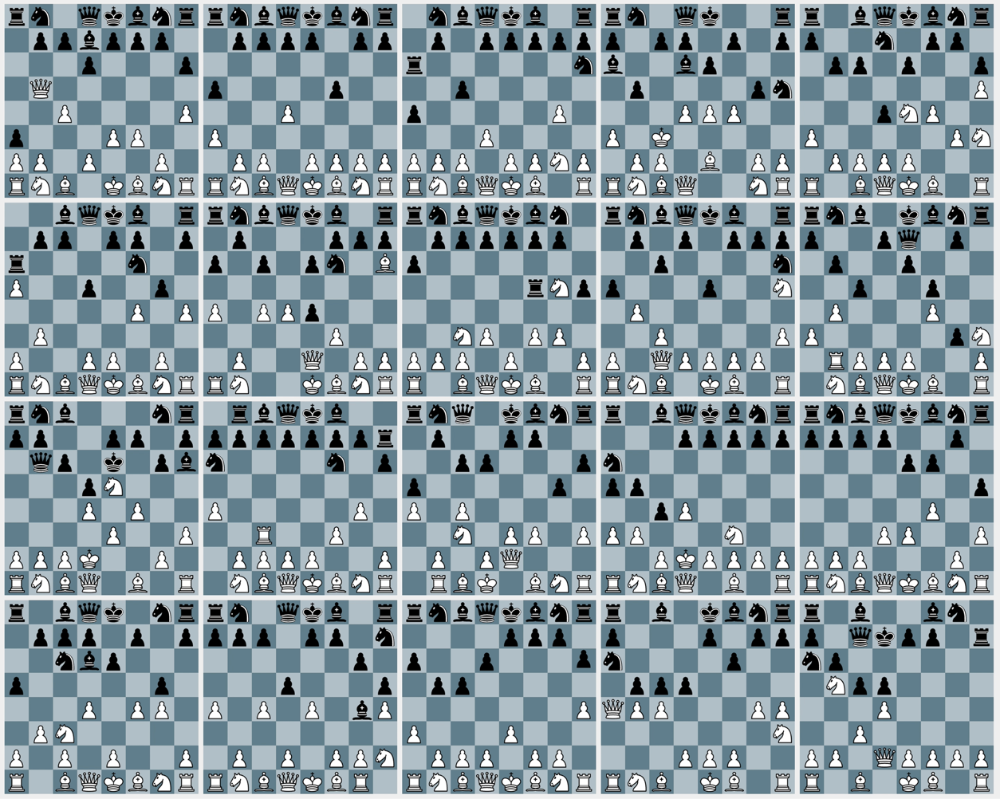

# Bots

Bots are long-running processes that can participate as full peers in a space.
The Bots framework allows you to create and deploy bots on a KUBE node. 

<br />


## Core concepts

* Bots don't have to, but are designed to contain DXOS client and be invited to a specific space.
* Bots are supposed to be up and running all the time unless explicitly stopped or removed.
  This also means that in most cases one would want to subscribe to some events in order for bot to be able to provide some service in response to those events.
* Bot factory is a service that manages bots. It is supposed to be run on a KUBE.
* Bundled file with a bot is uploaded to IPFS, and a record representing this bot is created in DXNS. 
  Bot factories are capable of resolving bot records in DXNS and downloading bundles from IPFS.

## Architecture

The diagram below illustrates the Bot architecture.


BotController is what exposes BotFactory service to the outer world. 
You can use [BotFactoryClient](bot-factory-client) to connect to and use BotFactory service in your code. 
To create a BotFactory client in your code you can do:

```typescript
  const topic = config.get('runtime.services.bot.topic');
  assert(topic, 'Topic must be provided');

  const botFactoryClient = new BotFactoryClient(client.echo.networkManager);
  await botFactoryClient.start(PublicKey.from(topic));
```
This will take topic from your client config and try to establish connection to a bot factory specified by this topic. 
The topic can be found at KUBE's services endpoint (e.g., [https://experimental.kube.dxos.network/kube/services](https://experimental.kube.dxos.network/kube/services)) under bot-factory name of service. 
Bot factory client and bot factory will be able to connect if they're connected to the same signal server. 
They communicate using custom [RPC](../common/rpc/). The communication implements [BotFactoryService](../common/proto/src/proto/dxos/bot.proto).
After a connection is established, bot factory client will be able to:
* Spawn a new bot. Bot can be defined in 3 ways:
  * DXN - resource identifier in DXNS. Bot factory will automatically fetch the record from DXNS using ContentResolver and get the IPFS CID of the bot bundled file. 
    Next steps are similar as in case of IPFS CID.
  * IPFS CID - hash of the bot bundled file stored in IPFS. Bot factory will automatically download the file to the bot directory created by bot factory.
  * Local path - path to a bot that is stored on the same machine where bot factory is running. Useful in local development.
* Invoke lifecycle methods on a given bot. Available methods are: start, stop, remove. 

Ultimately bot factory will able to spawn bots using different containers, but for now the only available container is Node container. 
Node container will run a javascript file using the `node` command.

After a bot is spawned, there are two entities that represent it:
* Bot process is a seperate OS process where the bot's code is executed. 
* Bot handle is an object that represents a bot process in the bot factory.
They communicate using custom [RPC](../common/rpc/). The communication implements [BotService](../common/proto/src/proto/dxos/bot.proto).

## Local development

To create a custom DXOS bot, extend Bot class and override necessary methods.

```typescript
  import { Bot } from '@dxos/botkit';

  const log = debug('dxos:bot:echo-bot');

  export class CustomBot extends Bot {
    override async onStart () {
      // ...your code that will be executed when bot starts
    }

    override async onCommand () {
      // ...your code that will be executed when bot receives a command
    }

    override async onStop () {
      // ...your code that will be executed when bot stops
    }
  }
```

In a separate file, create an instance of the bot, which will be the entrypoint of the bot.

```typescript
  import { createIpcPort, startBot } from '@dxos/botkit';

  import { CustomBot } from './custom-bot';

  if (typeof require !== 'undefined' && require.main === module) {
    const port = createIpcPort(process);
    void startBot(new CustomBot(), port);
  }
```

This will enable RPC communication between the bot handle and the bot.

Next you have to start a local signal server so later bot factory and bot factory client are visible to each other. 
Please run the following command in a separate termnial:

```bash
npx @dxos/signal
```

To run the bot you'll need to start a bot factory. 
Run the following commands in a separate terminal:

```bash
npm install -g @dxos/cli
dx bot factory install
dx bot factory setup
DEBUG=dxos:bot* dx bot factory start --dev
```

This will start a bot factory with logging enabled.
The topic that the bot factory listens on will be printed in logs. 
In the code snippet above we start a bot factory with a `--dev` flag. 
It forces the node container to require `ts-node/register/transpile-only` module, which should be installed and accessible globally. 
You can achieve this in the following way:
 
1. Run `npm install -g ts-node`.
2. Grab a path to global `ts-node`. You can achieve this by running `npm list -g` in a terminal, get the appropriate path and add `/node_modules` to the end.
3. Add the path from the previous step to the `NODE_PATH` variable and export it as an environment variable.

Example:

```bash
➜ npm list -g
/Users/username/.nodenv/versions/16.14.0/lib
├── node-pre-gyp@0.17.0
├── npm@7.11.2
└── ts-node@10.5.0
➜ export NODE_PATH=/Users/username/.nodenv/versions/16.14.0/lib/node_modules
```

To spawn a bot in a local development mode you need to create a space and open first:

```bash
dx space create
dx space open
```

This will enter the the interactive mode in the CLI. 
From now on all commands will be executed in context of the space. 
For instance bot spawned will be automatically invited to the space:

```bash
bot spawn --localPath /path/to/custom-bot/entrypoint
```

The bot should be up and running after this step - the effects of the code in methods `onStart`, `onCommand` and `onStop` should be visible. 
You should also be able access the bot via lifecycle methods:

```bash
bot list
bot stop [botId]
bot start [botId]
bot remove [botId]
```

You can get bot logs by running:

```bash
bot logs [botId]
```

## Deploy

Deploying a bot will make it accessible for bot-factories and other users. 
Bots are deployed in the same way as any other DXOS entity - using `dxns deploy` command. Example usage:

```bash
dx dxns deploy \   
  --config dx.yml \
  --path out \
  --tag latest \
  --version "1.0.0"
```

This will register the bot under the latest tag and version `1.0.0`. You can also provide only `--tag` or `--version` option. 
One more available option is `--skipExisting` - it will skip registering on DXNS if specified tag or version already exists. 
The `--out` option specifies a path to a directory containing bundled bot - this directory and its contents will get published to IPFS. 
In this example we'll publish contents of a folder named `out`. `--config` option specifies a path to a yaml config file - the convention is to name it `dx.yml`. 
The config structure is the same as in case of app config. The example config is provided below:

```yaml
version: 1

module:
  type: dxos:type.bot
  name: dxos:bot.exmaple
  description: Example bot
  author: DXOS.org
  license: MIT
  repository: 'https://github.com/dxos/example'

build:
  command: npm run release
```

The `module` field contains data that will be registered on DXNS. The `build` field contains info on how to build a bot. 
In this example we use `release` command from bot's `package.json` file. 
Let's take a look on how those commands might look like:

```json
{
  "scripts": {
    "bundle": "node ./scripts/bundle.js",
    "release": "rm -rf out && npm run bundle"
  }
}
```

Here we uses the script that bundles the bot. 
The recommended way to bundle a bot is to use `bundleBot` function provided by `@dxos/botkit` package. 
An Example script is provied below.

```javascript
const { buildBot } = require('@dxos/botkit/dist/src/botkit');

buildBot({ 
  entryPoint: './src/start-chess-bot.ts',
  outfile: './out/main.js'
});
```

Please note that the entry point of every bundled bot should be named `main.js` - after downloading bot's content form IPFS, 
bot factory will look for and run file named `main.js`. 
In our case we create a single file in the `out` directory named `main.js` - this the only file that will get published to IPFS. 

---
**NOTE**

In order to register a bot, you have to own a domain BOT_DOMAIN and enough funds on your DXNS account.

---

# Demos

[Chess demo](https://www.dropbox.com/s/gc76cu3z5xcexnf/Vlad-demo-chess-bot-1080p.mov?dl=0)
