# @dxos/bot-factory-client

Bot

## Dependency Graph

```mermaid
%%{ init: {'flowchart':{'curve':'basis'}} }%%

flowchart LR

%% Classes
classDef def fill:#fff,stroke:#333,stroke-width:1px
classDef root fill:#fff,stroke:#333,stroke-width:4px

%% Nodes

subgraph bots [bots]
  style bots fill:#baded0,stroke:#333
  dxos/bot-factory-client("@dxos/bot-factory-client"):::root
  click dxos/bot-factory-client "dxos/dxos/tree/main/packages/bots/bot-factory-client/docs"
end

subgraph common [common]
  style common fill:#bad0de,stroke:#333
  dxos/codec-protobuf("@dxos/codec-protobuf"):::def
  click dxos/codec-protobuf "dxos/dxos/tree/main/packages/common/codec-protobuf/docs"

  subgraph _ [ ]
    style _ fill:#bad0de,stroke:#333,stroke-dasharray:5 5
    dxos/async("@dxos/async"):::def
    click dxos/async "dxos/dxos/tree/main/packages/common/async/docs"
    dxos/debug("@dxos/debug"):::def
    click dxos/debug "dxos/dxos/tree/main/packages/common/debug/docs"
    dxos/keys("@dxos/keys"):::def
    click dxos/keys "dxos/dxos/tree/main/packages/common/keys/docs"
    dxos/log("@dxos/log"):::def
    click dxos/log "dxos/dxos/tree/main/packages/common/log/docs"
    dxos/util("@dxos/util"):::def
    click dxos/util "dxos/dxos/tree/main/packages/common/util/docs"
  end
end

subgraph core [core]
  style core fill:#abb6ed,stroke:#333
  dxos/protocols("@dxos/protocols"):::def
  click dxos/protocols "dxos/dxos/tree/main/packages/core/protocols/docs"

  subgraph mesh [mesh]
    style mesh fill:#b3b6e6,stroke:#333
    dxos/protocol-plugin-rpc("@dxos/protocol-plugin-rpc"):::def
    click dxos/protocol-plugin-rpc "dxos/dxos/tree/main/packages/core/mesh/protocol-plugin-rpc/docs"
    dxos/messaging("@dxos/messaging"):::def
    click dxos/messaging "dxos/dxos/tree/main/packages/core/mesh/messaging/docs"
    dxos/rpc("@dxos/rpc"):::def
    click dxos/rpc "dxos/dxos/tree/main/packages/core/mesh/rpc/docs"
    dxos/mesh-protocol("@dxos/mesh-protocol"):::def
    click dxos/mesh-protocol "dxos/dxos/tree/main/packages/core/mesh/mesh-protocol/docs"
  end
end

%% Links
linkStyle default stroke:#333,stroke-width:1px
dxos/bot-factory-client --> dxos/protocol-plugin-rpc
dxos/protocol-plugin-rpc --> dxos/messaging
dxos/protocols --> dxos/codec-protobuf
dxos/messaging --> dxos/rpc
dxos/rpc --> dxos/protocols
dxos/protocol-plugin-rpc --> dxos/mesh-protocol
dxos/mesh-protocol --> dxos/codec-protobuf
```

## Dependencies

| Module | Direct |
|---|---|
| [`@dxos/async`](../../../common/async/docs/README.md) | &check; |
| [`@dxos/codec-protobuf`](../../../common/codec-protobuf/docs/README.md) | &check; |
| [`@dxos/debug`](../../../common/debug/docs/README.md) |  |
| [`@dxos/keys`](../../../common/keys/docs/README.md) | &check; |
| [`@dxos/log`](../../../common/log/docs/README.md) |  |
| [`@dxos/mesh-protocol`](../../../core/mesh/mesh-protocol/docs/README.md) |  |
| [`@dxos/messaging`](../../../core/mesh/messaging/docs/README.md) |  |
| [`@dxos/protocol-plugin-rpc`](../../../core/mesh/protocol-plugin-rpc/docs/README.md) | &check; |
| [`@dxos/protocols`](../../../core/protocols/docs/README.md) | &check; |
| [`@dxos/rpc`](../../../core/mesh/rpc/docs/README.md) | &check; |
| [`@dxos/util`](../../../common/util/docs/README.md) |  |
