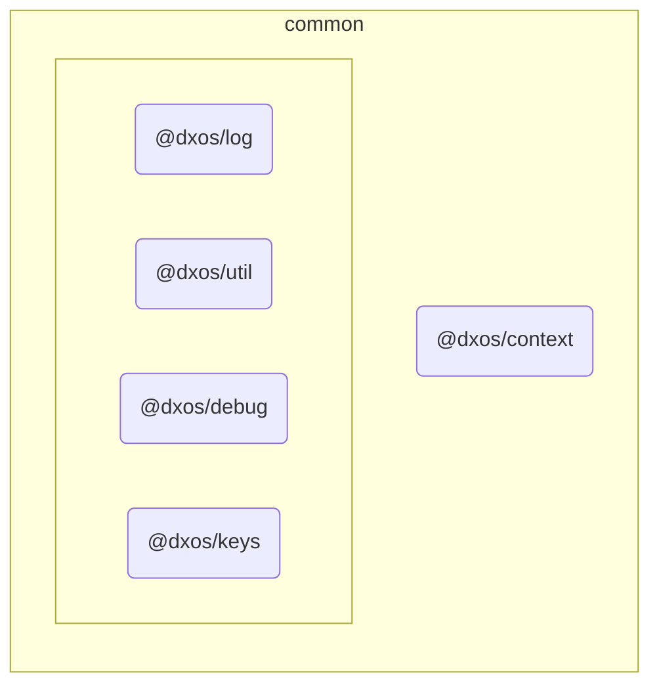

# @dxos/context

Async utils.

## Dependency Graph

## Dependencies

| Module | Direct |
|---|---|
| [`@dxos/debug`](../../debug/docs/README.md) |  |
| [`@dxos/keys`](../../keys/docs/README.md) |  |
| [`@dxos/log`](../../log/docs/README.md) | &check; |
| [`@dxos/util`](../../util/docs/README.md) | &check; |
