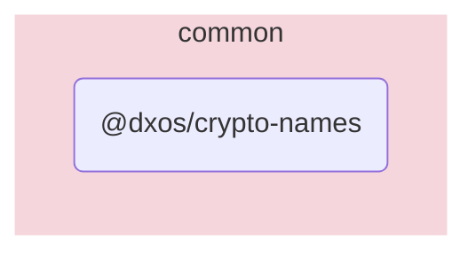

# @dxos/crypto-names

Basic crypto key utils
## Dependency Graph

```mermaid
flowchart LR;

subgraph common
  style common fill:#f5d6dd,stroke:#fff;
  dxos/crypto-names("@dxos/crypto-names");
end

```
## Dependencies
| Module | Direct |
|---|---|
