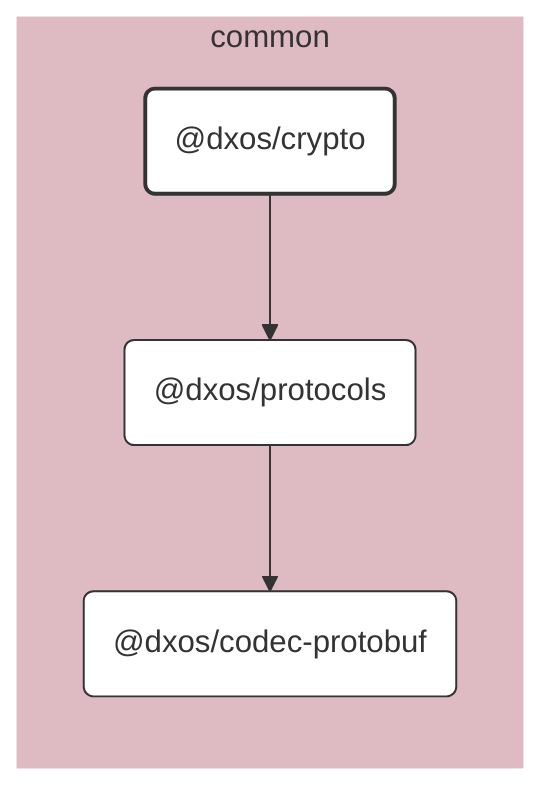

# @dxos/crypto

Basic crypto key utils

## Dependency Graph

## Dependencies

| Module | Direct |
|---|---|
| [`@dxos/codec-protobuf`](../../codec-protobuf/docs/README.md) |  |
| [`@dxos/protocols`](../../protocols/docs/README.md) | &check; |
