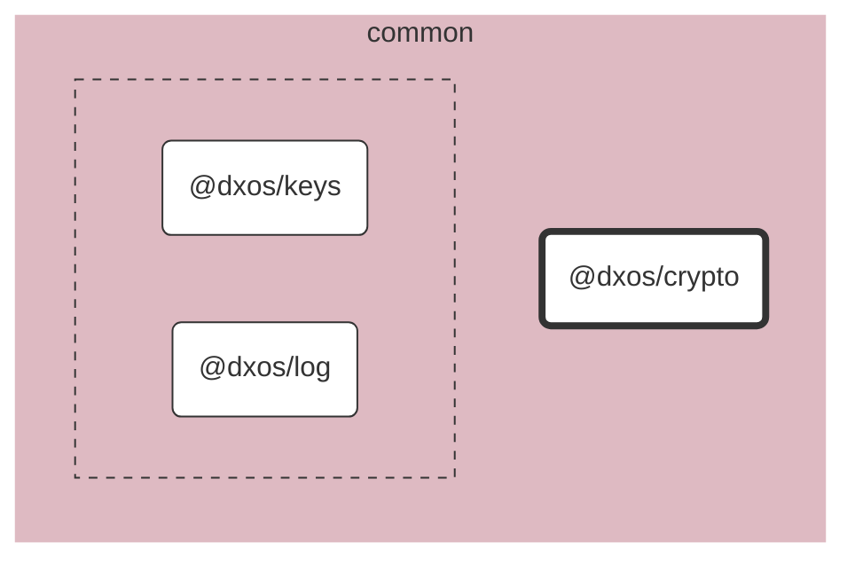

# @dxos/crypto

Basic cross-platform crypto utils.

## Dependency Graph

## Dependencies

| Module | Direct |
|---|---|
| [`@dxos/keys`](../../keys/docs/README.md) | &check; |
| [`@dxos/log`](../../log/docs/README.md) | &check; |
