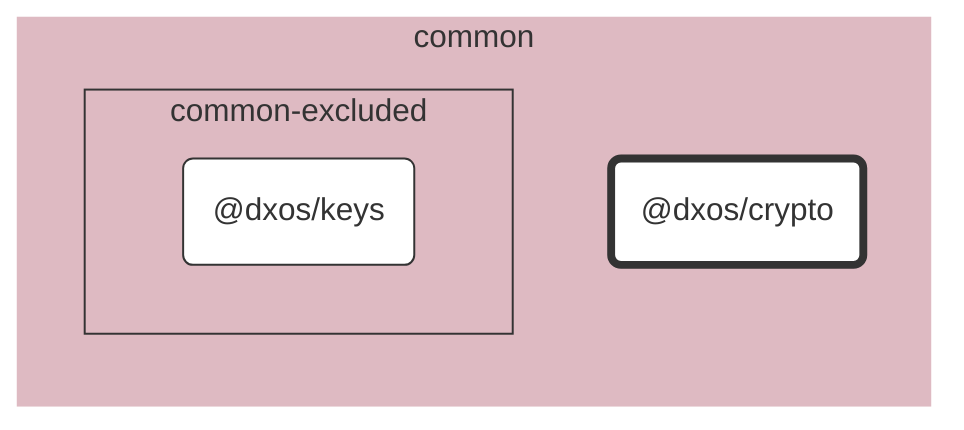

# @dxos/crypto

Basic crypto key utils

## Dependency Graph

```mermaid
%%{ init: {'flowchart':{'curve':'basis'}} }%%

flowchart LR

%% Classes
classDef def fill:#fff,stroke:#333,stroke-width:1px
classDef root fill:#fff,stroke:#333,stroke-width:4px

%% Nodes

subgraph common [common]
  style common fill:#debac2,stroke:#fff
  dxos/crypto("@dxos/crypto"):::root
  click dxos/crypto "dxos/dxos/tree/main/packages/common/crypto/docs"

  subgraph common-excluded [common-excluded]
    style common-excluded fill:#debac2,stroke:#333,stroke-dashed:5 5
    dxos/keys("@dxos/keys"):::def
    click dxos/keys "dxos/dxos/tree/main/packages/common/keys/docs"
  end
end

%% Links
linkStyle default stroke:#333,stroke-width:1px
```

## Dependencies

| Module | Direct |
|---|---|
| [`@dxos/keys`](../../keys/docs/README.md) | &check; |
