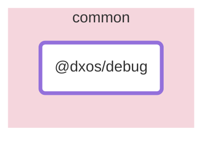

# @dxos/debug

Debug utilities

## Dependency Graph

```mermaid
flowchart LR;

style dxos/debug fill:#fff,stroke-width:4px;


subgraph common
  style common fill:#f5d6dd,stroke:#fff;
  dxos/debug("@dxos/debug");
end

```

## Dependencies

| Module | Direct |
|---|---|
