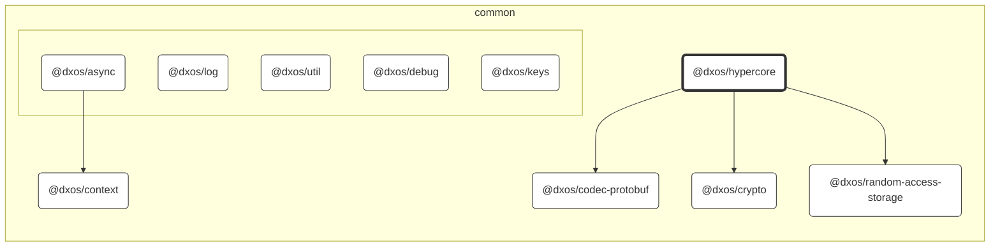

# @dxos/hypercore

Hypercore wrapper and utils.

## Dependency Graph

## Dependencies

| Module | Direct |
|---|---|
| [`@dxos/async`](../../async/docs/README.md) | &check; |
| [`@dxos/codec-protobuf`](../../codec-protobuf/docs/README.md) | &check; |
| [`@dxos/context`](../../context/docs/README.md) |  |
| [`@dxos/crypto`](../../crypto/docs/README.md) | &check; |
| [`@dxos/debug`](../../debug/docs/README.md) | &check; |
| [`@dxos/keys`](../../keys/docs/README.md) | &check; |
| [`@dxos/log`](../../log/docs/README.md) |  |
| [`@dxos/random-access-storage`](../../random-access-storage/docs/README.md) | &check; |
| [`@dxos/util`](../../util/docs/README.md) |  |
