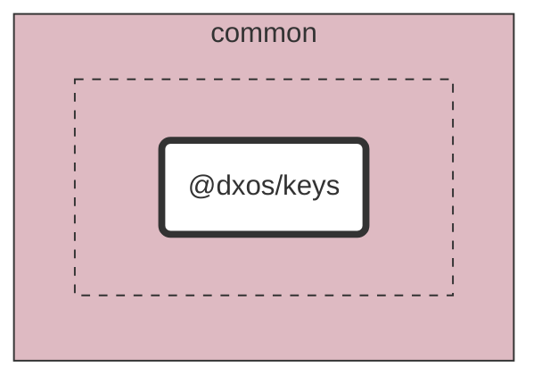

# @dxos/keys

Key utils and definitions.

## Dependency Graph

```mermaid
%%{ init: {'flowchart':{'curve':'basis'}} }%%

flowchart LR

%% Classes
classDef def fill:#fff,stroke:#333,stroke-width:1px
classDef root fill:#fff,stroke:#333,stroke-width:4px

%% Nodes

subgraph common [common]
  style common fill:#debac2,stroke:#333

  subgraph _ [ ]
    style _ fill:#debac2,stroke:#333,stroke-dasharray:5 5
    dxos/keys("@dxos/keys"):::root
    click dxos/keys "dxos/dxos/tree/main/packages/common/keys/docs"
  end
end

%% Links
linkStyle default stroke:#333,stroke-width:1px
```

## Dependencies

| Module | Direct |
|---|---|
