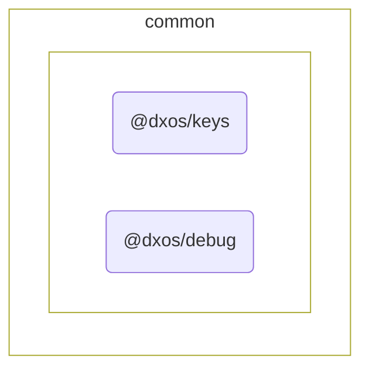

# @dxos/keys

Key utils and definitions.

## Dependency Graph

```mermaid
%%{ init: {'flowchart':{'curve':'basis'}} }%%

flowchart LR

%% Classes


%% Nodes

subgraph common [common]
  style common fill:transparent

  subgraph _ [ ]
    style _ fill:transparent
    dxos/keys("@dxos/keys"):::root
    click dxos/keys "dxos/dxos/tree/main/packages/common/keys/docs"
    dxos/debug("@dxos/debug"):::def
    click dxos/debug "dxos/dxos/tree/main/packages/common/debug/docs"
  end
end
```

## Dependencies

| Module | Direct |
|---|---|
| [`@dxos/debug`](../../debug/docs/README.md) | &check; |
