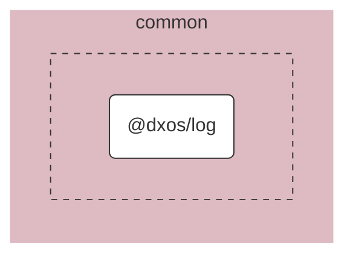

# @dxos/log

Logger

## Dependency Graph

```mermaid
%%{ init: {'flowchart':{'curve':'basis'}} }%%

flowchart LR

%% Classes
classDef def fill:#fff,stroke:#333,stroke-width:1px
classDef root fill:#fff,stroke:#333,stroke-width:4px

%% Nodes

subgraph common [common]
  style common fill:#debac2,stroke:#fff

  subgraph common-excluded [ ]
    style common-excluded fill:#debac2,stroke:#333,stroke-dasharray:5 5
    dxos/log("@dxos/log"):::def
    click dxos/log "dxos/dxos/tree/main/packages/common/log/docs"
  end
end

%% Links
linkStyle default stroke:#333,stroke-width:1px
```

## Dependencies

| Module | Direct |
|---|---|
