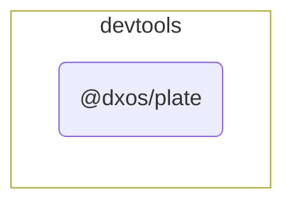

# @dxos/plate

## Dependency Graph

```mermaid
%%{ init: {'flowchart':{'curve':'basis'}} }%%

flowchart LR

%% Classes


%% Nodes

subgraph devtools [devtools]
  style devtools fill:transparent
  dxos/plate("@dxos/plate"):::root
  click dxos/plate "dxos/dxos/tree/main/packages/devtools/plate/docs"
end
```

## Dependencies

| Module | Direct |
|---|---|
