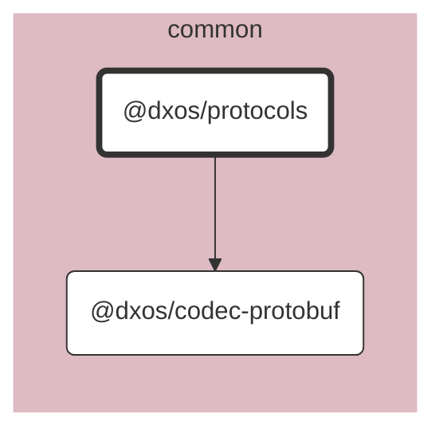

# @dxos/protocols

Protobuf definitions for DXOS protocols.

## Dependency Graph

## Dependencies

| Module | Direct |
|---|---|
| [`@dxos/codec-protobuf`](../../codec-protobuf/docs/README.md) | &check; |
