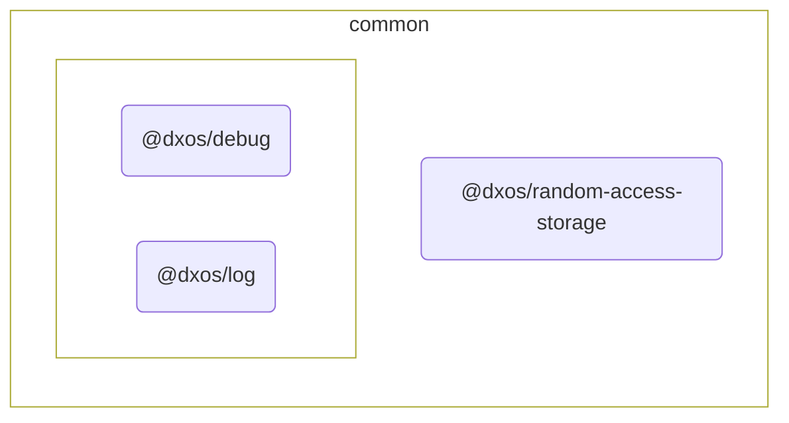

# @dxos/random-access-storage

Multiple random storage types.

## Dependency Graph

## Dependencies

| Module | Direct |
|---|---|
| [`@dxos/debug`](../../debug/docs/README.md) | &check; |
| [`@dxos/log`](../../log/docs/README.md) | &check; |
