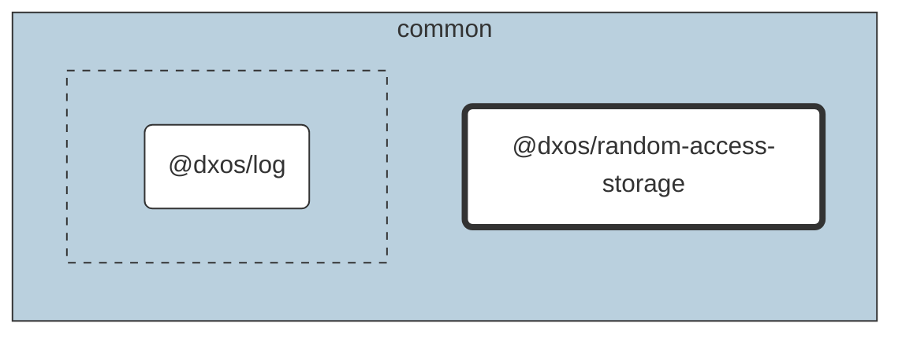

# @dxos/random-access-storage

Multiple random storage types.

## Dependency Graph

```mermaid
%%{ init: {'flowchart':{'curve':'basis'}} }%%

flowchart LR

%% Classes
classDef def fill:#fff,stroke:#333,stroke-width:1px
classDef root fill:#fff,stroke:#333,stroke-width:4px

%% Nodes

subgraph common [common]
  style common fill:#bad0de,stroke:#333
  dxos/random-access-storage("@dxos/random-access-storage"):::root
  click dxos/random-access-storage "dxos/dxos/tree/main/packages/common/random-access-storage/docs"

  subgraph _ [ ]
    style _ fill:#bad0de,stroke:#333,stroke-dasharray:5 5
    dxos/log("@dxos/log"):::def
    click dxos/log "dxos/dxos/tree/main/packages/common/log/docs"
  end
end

%% Links
linkStyle default stroke:#333,stroke-width:1px
```

## Dependencies

| Module | Direct |
|---|---|
| [`@dxos/log`](../../log/docs/README.md) | &check; |
