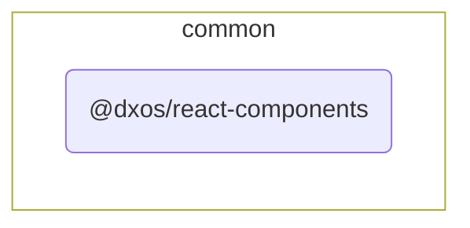

# @dxos/react-components

Vite plugin which configures a low-level design system for DXOS.

## Dependency Graph

```mermaid
%%{ init: {'flowchart':{'curve':'basis'}} }%%

flowchart LR

%% Classes


%% Nodes

subgraph common [common]
  style common fill:transparent
  dxos/react-components("@dxos/react-components"):::root
  click dxos/react-components "dxos/dxos/tree/main/packages/common/react-ui/docs"
end
```

## Dependencies

| Module | Direct |
|---|---|
