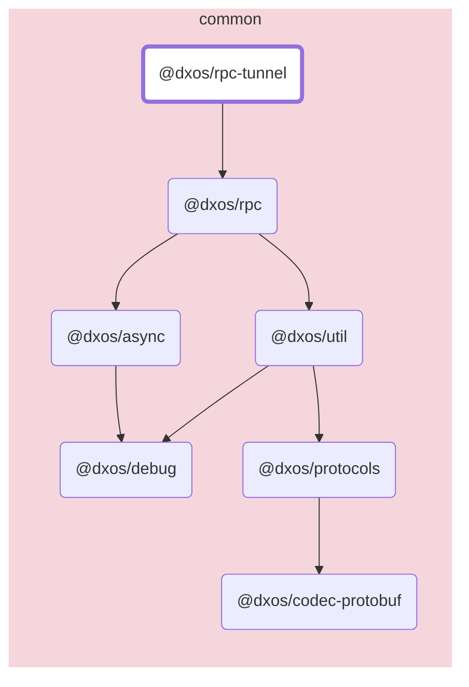

# @dxos/rpc-tunnel

RPC ports over various transports.

## Dependency Graph

## Dependencies

| Module | Direct |
|---|---|
| [`@dxos/async`](../../async/docs/README.md) |  |
| [`@dxos/codec-protobuf`](../../codec-protobuf/docs/README.md) |  |
| [`@dxos/debug`](../../debug/docs/README.md) |  |
| [`@dxos/protocols`](../../protocols/docs/README.md) |  |
| [`@dxos/rpc`](../../rpc/docs/README.md) | &check; |
| [`@dxos/util`](../../util/docs/README.md) |  |
