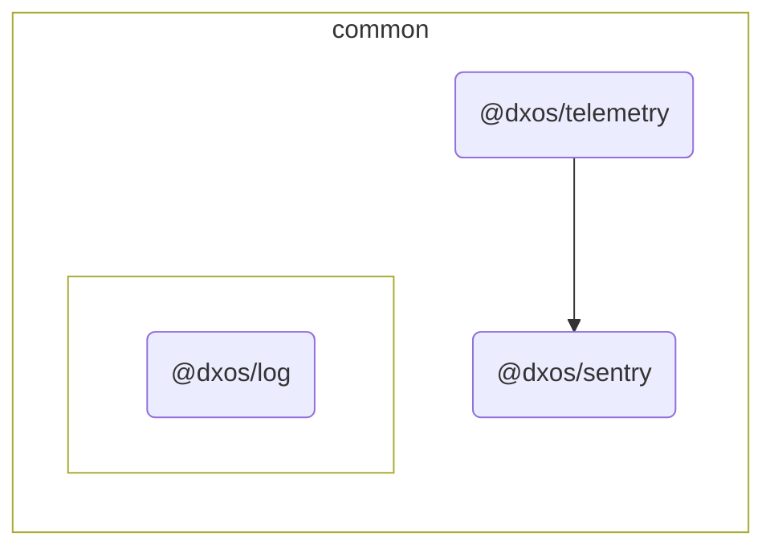

# @dxos/telemetry

Telemetry logging for product usage statistics

## Dependency Graph

## Dependencies

| Module | Direct |
|---|---|
| [`@dxos/log`](../../log/docs/README.md) | &check; |
| [`@dxos/sentry`](../../sentry/docs/README.md) | &check; |
