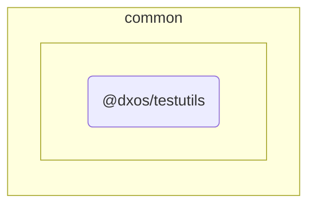

# @dxos/testutils

Test utilities

## Dependency Graph

```mermaid
%%{ init: {'flowchart':{'curve':'basis'}} }%%

flowchart LR

%% Nodes

subgraph common [common]

  subgraph _ [ ]
    dxos/testutils("@dxos/testutils"):::root
    click dxos/testutils "dxos/dxos/tree/main/packages/common/testutils/docs"
  end
end

%% Links
linkStyle default stroke:#333,stroke-width:1px
```

## Dependencies

| Module | Direct |
|---|---|
