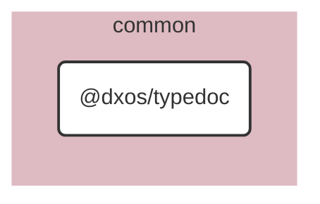

# @dxos/typedoc

DXOS Typedoc - API Reference.

## Dependency Graph

```mermaid
%%{ init: {'flowchart':{'curve':'basis'}} }%%

flowchart LR

%% Links

%% Sections
subgraph common
  style common fill:#debac2,stroke:#fff;

  dxos/typedoc("@dxos/typedoc")
end


%% Hyperlinks

%% Styles
classDef rootNode fill:#fff,stroke:#333,stroke-width:2px
classDef defaultNode fill:#fff,stroke:#333,stroke-width:1px
linkStyle default stroke:#333,stroke-width:1px

dxos/typedoc:::rootNode

```

## Dependencies

| Module | Direct |
|---|---|
