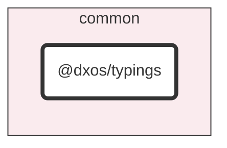

# @dxos/typings

Typescript defs.

## Dependency Graph

```mermaid
%%{ init: {'flowchart':{'curve':'basis'}} }%%

flowchart LR

%% Classes
classDef def fill:#fff,stroke:#333,stroke-width:1px
classDef root fill:#fff,stroke:#333,stroke-width:4px

%% Nodes

subgraph common [common]
  style common fill:#faebee,stroke:#333
  dxos/typings("@dxos/typings"):::root
  click dxos/typings "dxos/dxos/tree/main/packages/common/typings/docs"
end

%% Links
linkStyle default stroke:#333,stroke-width:1px
```

## Dependencies

| Module | Direct |
|---|---|
