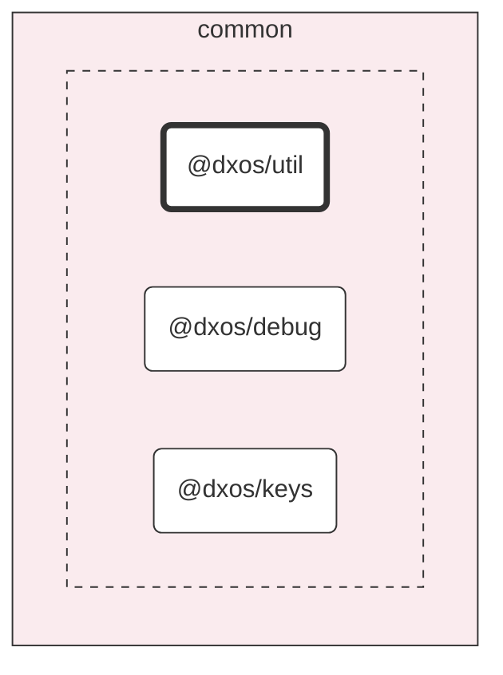

# @dxos/util

Temporary bucket for misc functions, which should graduate into separate packages.

## Dependency Graph

## Dependencies

| Module | Direct |
|---|---|
| [`@dxos/debug`](../../debug/docs/README.md) | &check; |
| [`@dxos/keys`](../../keys/docs/README.md) | &check; |
