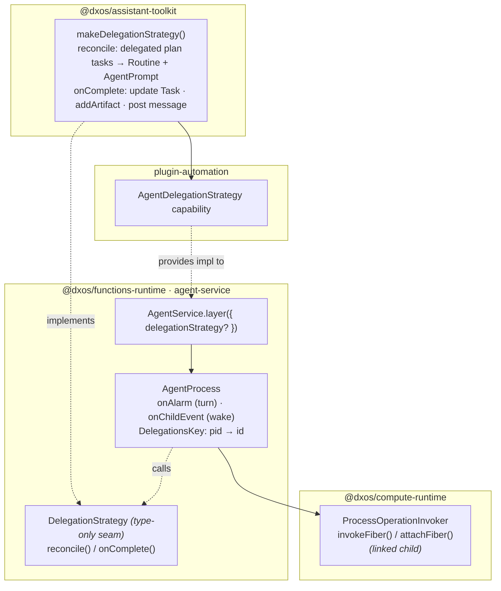
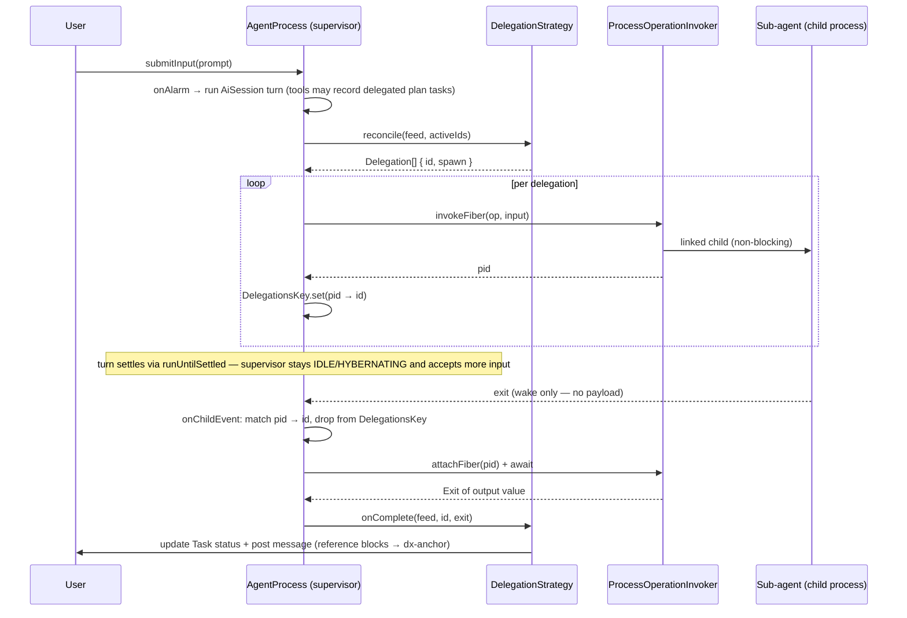

# Agent Service

`AgentService` spawns and caches a process-backed **agent** per conversation feed. The agent is a
long-lived `AgentProcess` that handles user turns; when a `DelegationStrategy` is injected it also
acts as a **supervisor** that delegates work to linked child processes and folds their results back
into the conversation.

## Layering

The supervisor behaviour is split across three layers so `@dxos/functions-runtime` stays agnostic of
the agent/plan ECHO types (it cannot depend on `@dxos/assistant-toolkit`).

- **`ProcessOperationInvoker`** (runtime primitive, no AI): `invokeFiber` spawns a linked,
  non-blocking child and returns a fiber with `pid`; `attachFiber` + `fiber.await` reads the
  finished child's `Exit`.
- **`DelegationStrategy`** (this dir, type-only): the pluggable policy `AgentProcess` calls —
  `reconcile` (what to delegate) and `onComplete` (how to fold a result back). Absent → plain chat.
- **`makeDelegationStrategy()`** (assistant-toolkit): the concrete, agent/plan-aware implementation,
  contributed by `plugin-automation` and injected through `AgentService.layer`.

## Delegation lifecycle

The child's exit is only a **wake signal** — its output value is read separately via
`attachFiber` + `fiber.await` (the `ChildEvent` does not carry the payload). `DelegationsKey` persists the
`pid → id` map so a child that exits after the supervisor hibernates can still be correlated.

## Key types

| Symbol | Where | Role |
| --- | --- | --- |
| `AgentService` / `layer` | `AgentService.ts` | Per-feed session cache (model-aware); wires `delegationStrategy` into `AgentProcess`. |
| `AgentProcess` | `agent-process.ts` | Turn loop (`onAlarm`) + child-exit wake (`onChildEvent`); owns `DelegationsKey`. |
| `DelegationStrategy`, `Delegation` | `delegation-strategy.ts` | Type-only seam: `reconcile` / `onComplete`; `Delegation = { id, spawn }`. |
| `ProcessOperationInvoker.invokeFiber` / `attachFiber` | `@dxos/compute-runtime` | Linked-child spawn + result read. |
| `makeDelegationStrategy()` | `@dxos/assistant-toolkit` | Concrete agent/plan-aware strategy. |
