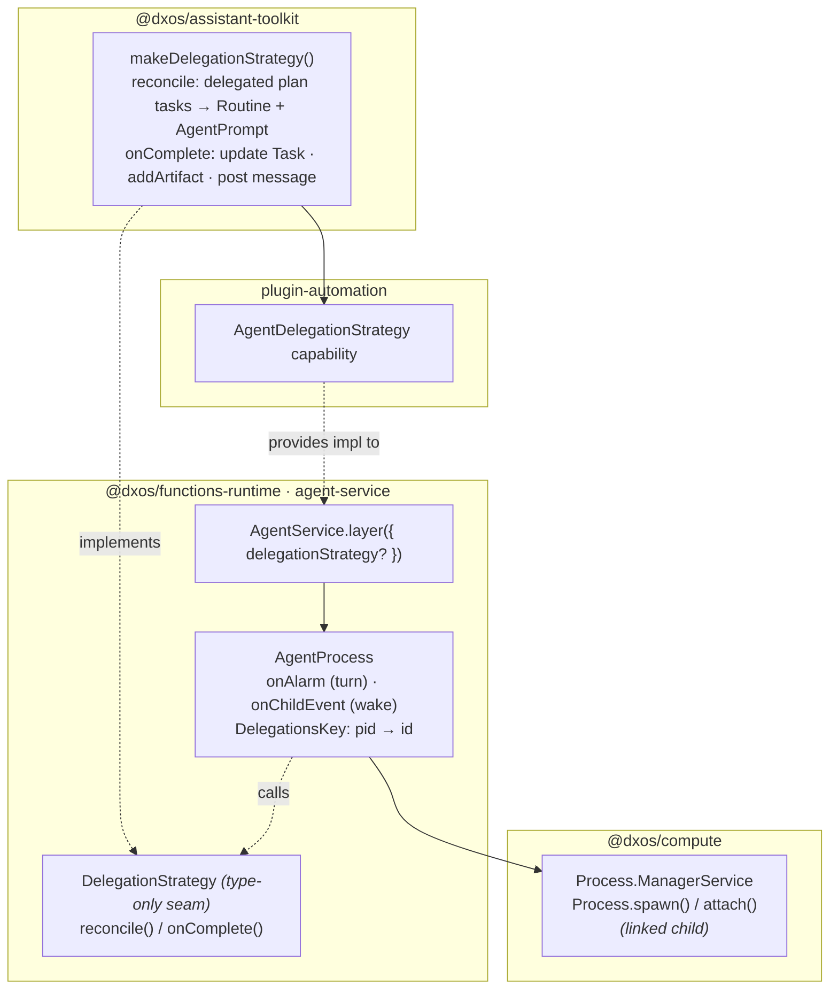
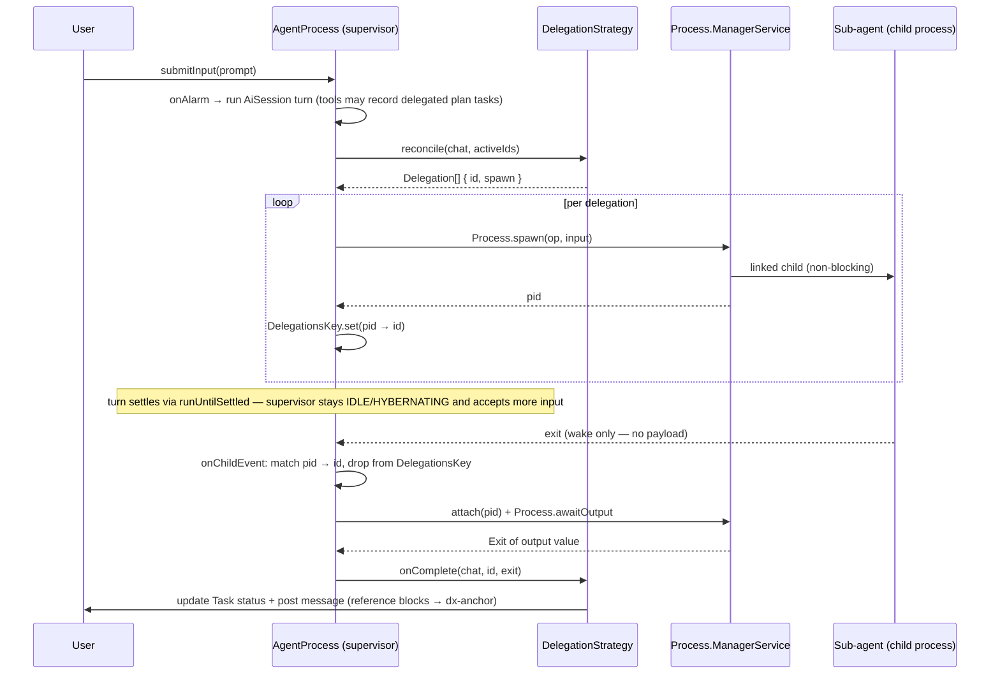

# Agent Service

`AgentService` spawns and caches a process-backed **agent** per `Chat`. The chat is the process's
spawn target, and the message feed, the steering instructions and the checklist are all read from
it — so a rehydrated process recovers them by re-reading the chat. 
The agent is a long-lived `AgentProcess` that handles user turns; 
when a `DelegationStrategy` is injected it also acts as a **supervisor** that delegates work 
to linked child processes and folds their results back into the conversation.

## Layering

The supervisor behaviour is split across three layers so `@dxos/functions-runtime` stays agnostic of
the agent/plan ECHO types (it cannot depend on `@dxos/assistant-toolkit`).

```mermaid
flowchart TB
  subgraph rt["@dxos/compute"]
    POI["Process.ManagerService<br/>Process.spawn() / attach()<br/><i>(linked child)</i>"]
  end

  subgraph fr["@dxos/functions-runtime · agent-service"]
    AS["AgentService.layer({ delegationStrategy? })"]
    AP["AgentProcess<br/>onAlarm (turn) · onChildEvent (wake)<br/>DelegationsKey: pid → id"]
    SS["DelegationStrategy <i>(type-only seam)</i><br/>reconcile() / onComplete()"]
    AS --> AP
    AP -. "calls" .-> SS
    AP --> POI
  end

  subgraph tk["@dxos/assistant-toolkit"]
    IMPL["makeDelegationStrategy()<br/>reconcile: delegated plan tasks → Routine + AgentPrompt<br/>onComplete: update Task · addArtifact · post message"]
  end

  subgraph pa["plugin-automation"]
    CAP["AgentDelegationStrategy capability"]
  end

  IMPL -. "implements" .-> SS
  CAP -. "provides impl to" .-> AS
  IMPL --> CAP
```

- **`Process.ManagerService`** (runtime primitive, no AI): the process's own manager links every child
  it spawns to the process. `Process.spawn` spawns an operation as such a child and returns its
  `Process.Process`; `attach(pid)` + `Process.awaitOutput` reads the finished child's result.
- **`DelegationStrategy`** (this dir, type-only): the pluggable policy `AgentProcess` calls —
  `reconcile` (what to delegate) and `onComplete` (how to fold a result back). Absent → plain chat.
- **`makeDelegationStrategy()`** (assistant-toolkit): the concrete, agent/plan-aware implementation,
  contributed by `plugin-automation` and injected through `AgentService.layer`.

## Delegation lifecycle

The child's exit is only a **wake signal** — its output value is read separately via
`attach(pid)` + `Process.awaitOutput` (the `ChildEvent` does not carry the payload). `DelegationsKey` persists the
`pid → id` map so a child that exits after the supervisor hibernates can still be correlated.

```mermaid
sequenceDiagram
  participant U as User
  participant AP as AgentProcess (supervisor)
  participant ST as DelegationStrategy
  participant POI as Process.ManagerService
  participant CH as Sub-agent (child process)

  U->>AP: submitInput(prompt)
  AP->>AP: onAlarm → run AiSession turn (tools may record delegated plan tasks)
  AP->>ST: reconcile(chat, activeIds)
  ST-->>AP: Delegation[] { id, spawn }
  loop per delegation
    AP->>POI: Process.spawn(op, input)
    POI->>CH: linked child (non-blocking)
    POI-->>AP: pid
    AP->>AP: DelegationsKey.set(pid → id)
  end
  Note over AP: turn settles via runUntilSettled — supervisor stays IDLE/HYBERNATING and accepts more input

  CH-->>AP: exit (wake only — no payload)
  AP->>AP: onChildEvent: match pid → id, drop from DelegationsKey
  AP->>POI: attach(pid) + Process.awaitOutput
  POI-->>AP: Exit of output value
  AP->>ST: onComplete(chat, id, exit)
  ST->>U: update Task status + post message (reference blocks → dx-anchor)
```

## Key types

| Symbol | Where | Role |
| --- | --- | --- |
| `AgentService` / `layer` | `AgentService.ts` | Per-chat session cache (model-aware); wires `delegationStrategy` into `AgentProcess`. |
| `AgentProcess` | `agent-process.ts` | Turn loop (`onAlarm`) + child-exit wake (`onChildEvent`); owns `DelegationsKey`. |
| `DelegationStrategy`, `Delegation` | `delegation-strategy.ts` | Type-only seam: `reconcile` / `onComplete`; `Delegation = { id, spawn }`. |
| `Process.spawn` / `Process.Manager.attach` | `@dxos/compute` | Linked-child spawn + result read. |
| `makeDelegationStrategy()` | `@dxos/assistant-toolkit` | Concrete agent/plan-aware strategy. |
