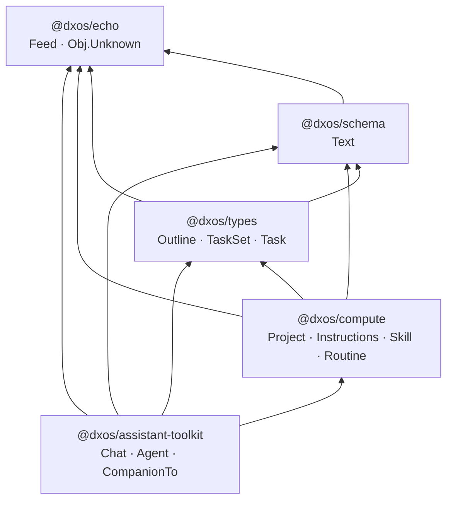

# Project type audit

Scope: everything reachable from [`Project.ts`](./Project.ts), plus the current
`Chat` ↔ companion wiring in `@dxos/assistant-toolkit` that this work stream normalizes.

Companion plan: [`agents/superpowers/plans/project-chat-relationship.md`](../../../../../../agents/superpowers/plans/project-chat-relationship.md).

## Types by package

| Package                   | Type           | Path                                                | DXN / version                                   | Edge from `Project`                                                                        | Ownership                                                 |
| ------------------------- | -------------- | --------------------------------------------------- | ----------------------------------------------- | ------------------------------------------------------------------------------------------ | --------------------------------------------------------- |
| `@dxos/compute`           | `Instructions` | `core/compute/compute/src/types/Instructions.ts`    | `org.dxos.type.instructions` 0.1.0              | `instructions: Ref` (optional)                                                             | owned — parented at plugin layer (`scaffold.ts`, stories) |
| `@dxos/compute`           | `Project`      | `core/compute/compute/src/types/Project.ts`         | `org.dxos.type.project` 0.4.0                   | —                                                                                          | root                                                      |
| `@dxos/compute`           | `Skill`        | `core/compute/compute/src/types/Skill.ts`           | `org.dxos.type.skill` 0.2.0                     | indirect, via `Instructions.skills[]`; also `SkillsAnnotation(['org.dxos.skill.project'])` | referenced (registry URI or DB clone)                     |
| `@dxos/assistant-toolkit` | `Agent`        | `core/compute/assistant-toolkit/src/types/Agent.ts` | `org.dxos.type.agent` 0.2.0                     | indirect, via `Chat.CompanionTo`                                                           | referenced                                                |
| `@dxos/assistant-toolkit` | `Chat`         | `core/compute/assistant-toolkit/src/types/Chat.ts`  | `org.dxos.type.assistant.chat` 0.1.0            | **no field** — ECHO parent edge only                                                       | owned via `Obj.setParent(chat, project)`                  |
| `@dxos/assistant-toolkit` | `CompanionTo`  | `core/compute/assistant-toolkit/src/types/Chat.ts`  | `org.dxos.relation.assistant.companionTo` 0.1.0 | relation `Chat → Obj.Unknown`                                                              | **to be removed**                                         |
| `@dxos/schema`            | `Text`         | `sdk/schema/src/types/Text.ts`                      | `org.dxos.type.text` 0.1.0                      | indirect, via `Instructions.text`                                                          | owned by `Instructions` (parented in `Instructions.make`) |
| `@dxos/types`             | `Outline`      | `sdk/types/src/types/Outline.ts`                    | `org.dxos.type.outline` 0.2.0                   | `outline: Ref` (optional)                                                                  | owned; created lazily by `Chat.ensureOutline`             |
| `@dxos/types`             | `TaskSet`      | `sdk/types/src/types/TaskSet.ts`                    | `org.dxos.type.taskSet` 0.3.0                   | `taskSet: Ref` (optional)                                                                  | owned — materialized + parented in `Project.make`         |
| `@dxos/echo`              | `Obj.Unknown`  | `core/echo/echo/src/Obj.ts`                         | —                                               | `artifacts: Ref[]`                                                                         | referenced, ordered                                       |
| `@dxos/echo`              | `Feed`         | `core/echo/echo/src/Feed.ts`                        | `org.dxos.type.feed` 0.1.0                      | indirect, via `Chat.feed`                                                                  | owned by `Chat` (parented at creation)                    |

Package dependency direction: `@dxos/assistant-toolkit` → `@dxos/compute` (Chat imports
`Project`; `Project` never imports `Chat`). Any normalization must keep that direction.

## Package dependencies

Workspace `dependencies` edges between the audited packages (arrow points at the dependency).
Foundations (`@dxos/echo`) at the top; `@dxos/assistant-toolkit` at the bottom may import
`Project`, never the reverse.

## Edge inventory

Three distinct mechanisms currently express "this chat belongs to X":

1. **ECHO parent edge** (`Obj.setParent` / `Obj.Parent`). Cascade-deletes, always loaded with
   the object, queryable via `Query…children()` / `.parent()`.
   - `Project` → `TaskSet` (`Project.make`)
   - `Project` → `Instructions` (`templates/scaffold.ts`, `ProjectArticle.stories.tsx`)
   - `Project` → `Chat` (`plugin-projects/src/operations/create-chat.ts:35`)
   - `Agent` → `Chat`, `Agent` → `Instructions`, `Chat` → `Feed` (`Agent.makeInitialized`)
   - `Instructions` → `Text` (`Instructions.make`)
2. **Typed refs** on `Project` (`instructions`, `outline`, `taskSet`, `artifacts`).
3. **`CompanionTo` relation** (`Chat` → `Obj.Unknown`) — the one being retired.

## Former `Chat` ↔ companion wiring via `CompanionTo` (removed on this branch)

> Historical record of the pre-migration state; every site below now uses the ECHO parent edge
> (`Obj.setParent(chat, subject)`), and `standaloneChatsQuery` selects `Filter.hasParent(false)`.

`CompanionTo` is a `Type.makeRelation` with `source: Chat`, `target: Obj.Unknown` and no payload
beyond `id`. It is overloaded across two unrelated meanings:

- **companion-of-an-artifact** — the chat opened in the companion panel next to a Markdown doc,
  table, etc.
- **runs-as-an-agent** — `Agent.loadForChat` / `Agent.loadChat` traverse the same relation to find
  the `Agent` identity a conversation runs as.

`Agent.makeInitialized` already sets **both** edges to the same object: `Chat.make({ [Obj.Parent]: agent })`
plus a `CompanionTo` relation to that agent (`Agent.ts:166`, `Agent.ts:180`). The parent edge is
therefore already redundant with the relation on the agent path.

### Call sites

| Site                                                                               | Use                                              | Direction                |
| ---------------------------------------------------------------------------------- | ------------------------------------------------ | ------------------------ |
| `assistant-toolkit/src/types/Chat.ts:151`                                          | declaration                                      | —                        |
| `assistant-toolkit/src/types/Agent.ts:90` `loadChat`                               | agent → its primary chat                         | `targetOf(...).source()` |
| `assistant-toolkit/src/types/Agent.ts:101` `loadForChat`                           | chat → agent it runs as                          | `sourceOf(...).target()` |
| `assistant-toolkit/src/types/Agent.ts:180` `makeInitialized`                       | writes relation (alongside `Obj.Parent`)         | create                   |
| `assistant-toolkit/src/types/Agent.ts:238,248` `resetChatHistory`                  | retire old link, write new                       | delete + create          |
| `plugin-assistant/src/capabilities/app-graph-builder.ts:53` `standaloneChatsQuery` | exclude companion chats from the Chats section   | `sourceOf(...).source()` |
| `plugin-assistant/src/operations/ensure-companion-chat.ts:24`                      | find the persisted chat for a companion subject  | `targetOf(...).source()` |
| `plugin-assistant/src/operations/fork-chat.ts:90`                                  | wire a forked chat as companion                  | create                   |
| `plugin-assistant/src/containers/ChatCompanion/ChatCompanion.tsx:46`               | persist transient companion chat on first submit | create                   |
| `plugin-assistant/src/hooks/useChatToolbarActions.ts:33`                           | list sibling companion chats for the toolbar     | `targetOf(...).source()` |
| `plugin-assistant/src/capabilities/schema-defs.ts:19`                              | schema registration                              | —                        |
| `assistant-toolkit/src/testing/operations.ts:50` + 8 test files                    | schema registration in test layers               | —                        |

### Asymmetry with the project path

`Project`-scoped chats already use the parent edge exclusively (`create-chat.ts` explicitly avoids
`SpaceOperation.AddObject`), and `plugin-projects`' `projectChats` connector enumerates them with
`Query.select(Filter.id(project.id)).children()`. `standaloneChatsQuery` must therefore subtract
**two** things today: `CompanionTo` sources _and_ `Project` children. Collapsing companions onto the
parent edge collapses those two subtractions into one.

## Known gap for the migration (resolved)

There was no `Filter`/`Query` predicate for "object with no parent"; `standaloneChatsQuery` was
built by subtracting each known parent type's `children()`. Resolved: `Filter.hasParent` landed in
`@dxos/echo` and the query is now `Filter.and(Filter.type(Chat), Filter.hasParent(false))`.

## Package placement rule (decided 2026-08-19)

The `@dxos/compute` / `@dxos/assistant-toolkit` type split is load-bearing, not accidental: **a
type lives in `@dxos/compute` if it is harness-independent automation vocabulary; in
`@dxos/assistant-toolkit` if its companion code needs the conversation runtime.**
`Project`/`Skill`/`Instructions`/`Routine`/`Trigger` pass the first test (`pipeline-email` builds a
Project corpus and `plugin-routine` compiles Instructions without touching an AI client);
`Chat`/`Agent` fail it (`Chat.getFromContext` resolves through the Harness,
`Agent.makeInitialized` drives `AiContext.Binder`). Consolidating in either direction creates a
package cycle: `Skill`/`Instructions` have consumers below assistant-toolkit (including
`@dxos/assistant` itself), and `Chat`/`Agent` depend — lazily but structurally — on
`@dxos/assistant`, which depends on `@dxos/compute`. `Project` is the one movable piece, and moving
it (to assistant-toolkit or plugin-projects) would force non-AI consumers (`pipeline-email`)
through the AI runtime or a plugin — rejected.

## Surfacing decision (not changed by this work)

Companion chats on ordinary artifacts are reached through the companion panel and are deliberately
absent from the navtree. Project chats are the exception: they appear as the project's navtree
children (`plugin-projects` `createProjectChatsExtension`). That connector therefore stays
project-specific and stays in `plugin-projects`.
