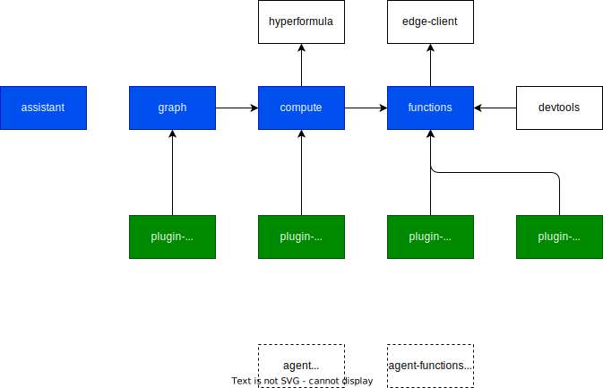

# Compute

We have the following high-level core concepts:

- Functions (@dxos/functions): Remote functions executed on the EDGE.
- Compute (@dxos/compute): A client/server function abstraction, currently dependent on hyperformula.
- Graph (@dxos/graph): A very low-level graph utility.

We need a general purpose dependency-graph abstraction that can be partially fulfilled on the client and server.

Scenarios:

- Spreadsheet invokes a local function (e.g., SUM).
- Spreadsheet invokes a remote function (e.g., FOREX), or a hierarchical graph of local and remote (async) functions.
- Automation plugin configures a function to be run when a chess game updates.
- Automation plugin configures a function to be run when an email is received.
- AI service responds to a chat.
- Automation plugin configures a pipeline of local and remote functions to run in the background (agent).

