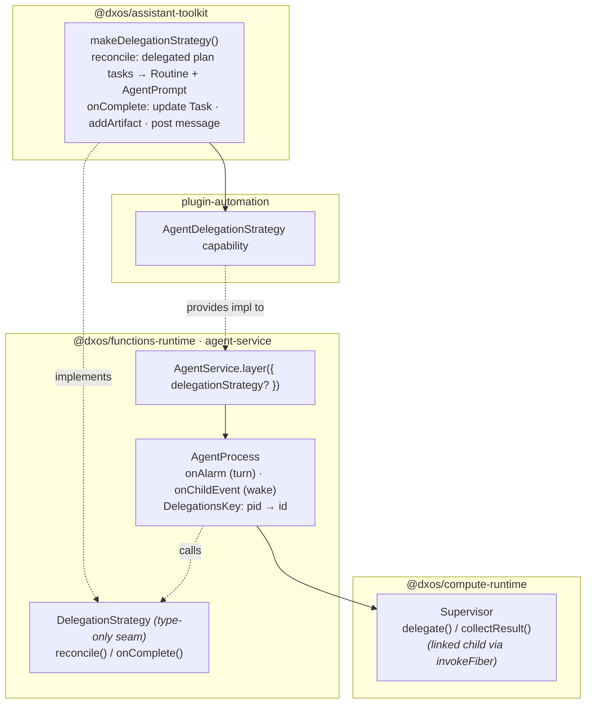

# Agent Service

`AgentService` spawns and caches a process-backed **agent** per conversation feed. The agent is a
long-lived `AgentProcess` that handles user turns; when a `DelegationStrategy` is injected it also
acts as a **supervisor** that delegates work to linked child processes and folds their results back
into the conversation.

## Layering

The supervisor behaviour is split across three layers so `@dxos/functions-runtime` stays agnostic of
the agent/plan ECHO types (it cannot depend on `@dxos/assistant-toolkit`).



- **`Supervisor`** (runtime primitive, no AI): `delegate` spawns a linked, non-blocking child and
  returns its `pid`; `collectResult` reads the finished child's `Exit` via the retained fiber.
- **`DelegationStrategy`** (this dir, type-only): the pluggable policy `AgentProcess` calls —
  `reconcile` (what to delegate) and `onComplete` (how to fold a result back). Absent → plain chat.
- **`makeDelegationStrategy()`** (assistant-toolkit): the concrete, agent/plan-aware implementation,
  contributed by `plugin-automation` and injected through `AgentService.layer`.

## Delegation lifecycle

The child's exit is only a **wake signal** — its output value is read separately via
`collectResult` (the `ChildEvent` does not carry the payload). `DelegationsKey` persists the
`pid → id` map so a child that exits after the supervisor hibernates can still be correlated.

```mermaid
sequenceDiagram
  participant U as User
  participant AP as AgentProcess (supervisor)
  participant ST as DelegationStrategy
  participant SUP as Supervisor
  participant CH as Sub-agent (child process)

  U->>AP: submitInput(prompt)
  AP->>AP: onAlarm → run AiSession turn (tools may record delegated plan tasks)
  AP->>ST: reconcile(feed, activeIds)
  ST-->>AP: Delegation[] { id, spawn }
  loop per delegation
    AP->>SUP: spawn = Supervisor.delegate(op, input)
    SUP->>CH: invokeFiber (linked, non-blocking)
    SUP-->>AP: pid
    AP->>AP: DelegationsKey.set(pid → id)
  end
  Note over AP: turn settles (runUntilSettled); supervisor stays IDLE/HYBERNATING, accepts more input

  CH-->>AP: exit (wake only — no payload)
  AP->>AP: onChildEvent: match pid → id, drop from DelegationsKey
  AP->>SUP: collectResult(pid)
  SUP-->>AP: Exit<output>
  AP->>ST: onComplete(feed, id, exit)
  ST->>U: update Task status + post message (reference blocks → dx-anchor)
```

## Key types

| Symbol | Where | Role |
| --- | --- | --- |
| `AgentService` / `layer` | `AgentService.ts` | Per-feed session cache (model-aware); wires `delegationStrategy` into `AgentProcess`. |
| `AgentProcess` | `agent-process.ts` | Turn loop (`onAlarm`) + child-exit wake (`onChildEvent`); owns `DelegationsKey`. |
| `DelegationStrategy`, `Delegation` | `delegation-strategy.ts` | Type-only seam: `reconcile` / `onComplete`; `Delegation = { id, spawn }`. |
| `Supervisor.delegate` / `collectResult` | `@dxos/compute-runtime` | Linked-child spawn + result read. |
| `makeDelegationStrategy()` | `@dxos/assistant-toolkit` | Concrete agent/plan-aware strategy. |
