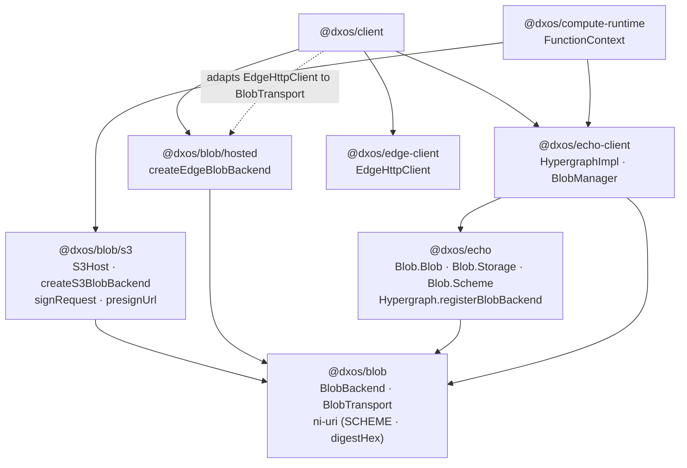

# Blob storage naming (`edge`/`ni:` → `blob`)

The DXOS-hosted blob store is registered under the storage name `edge` and emits `ni:` URIs. Both
names are wrong in a way that has cost real design time, and both are persisted on existing `Blob`
objects, so correcting them is a migration rather than a rename.

## The two problems

**`edge` claims the platform for one storage target.** EDGE is the whole backend architecture; the
blob service is one worker inside it. `Blob.Storage.edge` reads as "the EDGE backend" when it means
"the store DXOS hosts for you". Naming it after the current implementation (`blob-service`) would be
no better — it would go stale the moment the service is re-implemented.

**`ni:` names an addressing style, not a backend.** `BlobManager` dispatches reads on a
`Map<scheme, backend>` ([blob-manager.ts](../../echo-client/src/blob/blob-manager.ts)), so a scheme is functionally a backend
selector. Every other scheme behaves that way — `s3:`, `wnfs:` — and `ni:` is the one entry that
describes a property instead of an owner. That is the entire reason a hypothetical IPFS backend
raises a collision question: IPFS is also content-addressed, so it has a claim on `ni:` that it
would never have on a scheme naming its owner.

The RFC 6920 conformance being given up is unrealized value: nothing outside DXOS consumes these
URIs today, so the spec buys option value rather than actual interop.

## Decision

**Scheme names the backend. The DXOS-hosted store becomes `blob`.**

| Custody                 | Storage name          | Scheme  | Example reference                                                    |
| ----------------------- | --------------------- | ------- | -------------------------------------------------------------------- |
| In the object           | `inline`              | none    | bytes on the object (`_tag: 'inline'`)                               |
| DXOS-hosted             | `blob` (today `edge`) | `blob:` | `blob:///sha-256;UyaQNQIUxQKgg1jVMKMbg1Yr8Rrb2Y3RaOx2N0mVJhc`        |
| Public network          | `ipfs` (hypothetical) | `ipfs:` | `ipfs://bafybeigdyrzt5sfp7udm7hu76uh7y26nf3efuylqabf3oclgtqy55fbzdi` |
| Bring-your-own endpoint | `s3`                  | `s3:`   | `s3://media.abc123.r2.cloudflarestorage.com/SPACEID/deadbeef`        |
| Space-local / peer      | `wnfs`                | `wnfs:` | `wnfs://spaces/<spaceId>/files/<cid>`                                |

Custody is the axis that separates these, not addressing — `blob` and `ipfs` are both
content-addressed, so "content-addressed" cannot discriminate between them.

### Why the triple slash

`blob:///sha-256;<base64url>`, mirroring `ni:///` exactly.

DOM object URLs are `blob:https://origin/uuid` — opaque, with no `//` after the colon. `blob:///…`
is therefore structurally distinct from them at a glance and to a parser, while `blob:sha-256;…`
would be shape-identical. Both forms appear in this codebase, since `BlobBackend.getUrl` returns DOM
object URLs, so telling them apart matters.

The empty authority is also the honest statement: there is no host, because a digest does not name a
location.

The algorithm field is carried over from RFC 6920 deliberately — it costs nothing and means a future
digest change does not need a new scheme.

## Packaging

Blob functionality used to be spread across five packages — the contract in `echo-protocol`, the
registry and `ni:` encoding in `echo-client`, the hosted backend in `sdk/client`, and backends in two
plugins. "Which package owns blobs?" had no answer.

`@dxos/blob` now holds the contract, the URI encoding, and both non-plugin backends as subpaths. The
registry stays in `@dxos/echo-client` — not an omission, see below.

Two things the arrows are carrying. `echo --> blob`, not the reverse — an earlier draft of this
diagram had it backwards, which is what the next section is about. And the dotted edge: nothing in
the blob layer depends on `@dxos/edge-client`; `@dxos/client` adapts its `EdgeHttpClient` to
`BlobTransport` at the one registration site.

### Why `BlobManager` is not in this package

`@dxos/blob` sits **below** `@dxos/echo`, not above it. `Hypergraph` exposes
`registerBlobBackend(name, backend: BlobBackend, …)`, so `@dxos/echo` imports the contract — and
anything the contract's package imports cannot import `@dxos/echo` back.

`BlobManager` does: it creates `Blob.Blob` objects, reads `Blob.Storage.inline`, and throws
`EchoError.BlobTooLargeError`. So it stays in `@dxos/echo-client`, which is above echo. An attempt
to move it here failed with moon's `project_graph::would_cycle`, which is the graph stating the same
constraint.

The blob _schema_ cannot come down to meet it either: `Blob.ts` is built on echo's `Obj`, `Type`,
`Annotation` and `Database` modules — it is ECHO schema in the full sense, not a plain struct.

Both backends live here because neither needs echo. The hosted one reads its scheme from `ni-uri`'s
`SCHEME` rather than `Blob.Scheme.ni`; the two are the same string `'ni'`, and taking it from the
lower package is what keeps the edge out of the graph.

### Backends take capabilities, not clients

`EdgeHttpClient` is a 727-line class with 33 public methods spanning identity, notarization,
invitations, OAuth, queues, blobs, functions, workflows, cron triggers, the plugin registry, and AI
proxying. The hosted blob backend needs four of them. Depending on the class drags in the other 29.

So each backend declares the narrow interface it actually needs:

| Backend | Capability it takes                                     | Status                               |
| ------- | ------------------------------------------------------- | ------------------------------------ |
| hosted  | `BlobTransport` — `url`, `put`, `get`, `has`            | done                                 |
| s3      | `S3Host` — `resolveCredentials`, `resolveWriteEndpoint` | done                                 |
| wnfs    | a blockstore accessor                                   | not started — still takes a `Client` |

The S3 backend already works this way, because the headless path forced it: `operation-service` has
`Database.Service` and no `Client`, so taking a client was not an option. That constraint produced
the right shape for all of them — a backend that takes capabilities is registrable in a browser, a
worker, or a test without a client graph behind it.

`EdgeHttpClient`'s blob methods take a leading `Context`, so `BlobTransport` is not a structural
match for it. That is deliberate: threading `Context` into the interface would make `@dxos/blob`
depend on `@dxos/context` to carry a value the blob layer never reads, a worse trade than four lines
of adapter at a single call site.

`edge-client` itself wants the same treatment. Its 33 methods cluster into identity, queue, blob,
compute, registry, and gateway groups. Split those as **subpath exports first**
(`@dxos/edge-client/blob`), not packages: it gives the tree-shaking and the ownership boundary with
none of the publishing overhead, it is reversible, and the package already has precedent for
internal layering (`base-http-client.ts` → `http-client.ts` → `hub-http-client.ts`). Promote a group
to its own package only where a boot-budget measurement or an ownership boundary justifies it.

## Known limitation

This decision entrenches scheme = backend identity. The digest stays _semantically_
location-independent while becoming _syntactically_ owned, so one reference resolvable from several
stores is no longer expressible in the URI alone. Two features want that:

- the local cache blocked in [hosted/blob-backend.ts](../src/hosted/blob-backend.ts), which needs to
  serve a `blob:` reference from disk before reaching the network;
- an IPFS mirror of DXOS-hosted content.

Both would need a resolution-order mechanism — several backends expressing interest in one
reference — rather than falling out of a shared scheme. The alternative considered was a universal
`blob://<store>/<ref>` scheme dispatching on authority, which gives multi-store resolution for free
but requires a `BlobManager` contract change now for a feature that is speculative. Revisit if
either feature becomes real.

## Call sites

Contained — nine source files.

| File                                                                                                                  | Kind         | Notes                                                                                                                      |
| --------------------------------------------------------------------------------------------------------------------- | ------------ | -------------------------------------------------------------------------------------------------------------------------- |
| [echo/src/Blob.ts](../../echo/src/Blob.ts)                                                                            | API          | `Storage = { inline, edge }` and `Scheme = { ni }`. Both constants change; `Scheme.ni` is retained read-side.              |
| [src/ni-uri.ts](../src/ni-uri.ts)                                                                                     | Encoding     | `fromDigest`/`fromDigestHex` emit `ni:///${ALG};…`; `decode` rejects non-`ni:`. Becomes the dual-read boundary.            |
| [src/hosted/blob-backend.ts](../src/hosted/blob-backend.ts)                                                           | Backend      | Declares `schemes: [SCHEME]`, calls `fromDigestHex`/`parseNiUri`. Must accept both schemes on read, emit `blob:` on write. |
| [echo-client/src/blob/blob-manager.ts](../../echo-client/src/blob/blob-manager.ts)                                    | Registry     | `#defaultStorage` initialises to `Storage.inline`; no `ni:` knowledge of its own.                                          |
| [client/src/client/client.ts](../../../../sdk/client/src/client/client.ts)                                            | Registration | Registers under `Blob.Storage.edge` with `{ default: true }`.                                                              |
| [plugin-file/…/edge-backend.ts](../../../../plugins/plugin-file/src/capabilities/edge-backend.ts)                     | Descriptor   | Settings-UI entry naming the backend. User-visible label.                                                                  |
| `src/ni-uri.test.ts`, `src/hosted/blob-backend.test.ts`, `echo-client/src/blob/blob.test.ts`, `echo/src/Blob.test.ts` | Tests        | Pin the literal strings `'edge'`, `'ni'`, and `ni:///sha-256;3q2-7w`.                                                      |

## Migration

Persisted data is the constraint: existing `Blob` objects hold `ni:` URIs and existing spaces hold
the storage name `edge`. Neither can be rewritten in place across peers that may be offline.

1. **Read both, write one.** The hosted backend declares `schemes: ['blob', 'ni']` and emits `blob:`
   for new writes. `ni:` stays supported read-side indefinitely — it is two characters of
   compatibility, not a deprecation to chase.
2. **Alias the storage name.** `Blob.Storage.blob = 'blob'`, with `'edge'` resolving to the same
   registered backend so existing space settings keep working.
3. **Do both renames together.** The storage name and the scheme are stored on the same objects, so
   splitting them into two migrations doubles the compatibility surface for no benefit.
4. **Leave the plugin descriptor label to last** — it is user-visible text and worth deciding
   separately from the wire format.

Not started; no code in this repository has been changed for it yet.

## Implementation status

- [x] **`BlobTransport`** — the hosted backend takes four operations instead of a 33-method client.
      `client.ts` adapts `EdgeHttpClient` at the registration site. Side benefit: the backend's tests
      no longer need `as unknown as EdgeHttpClient` to assert a whole class from a one-method stub.
- [x] **`@dxos/blob` package** — holds the contract (`BlobBackend`, `BlobTransport`,
      `BlobPutRequest`/`Response`), moved out of `@dxos/echo-protocol` with every call site repointed
      and no compatibility re-export.
- [x] **URI encoding and both backends moved in** — `ni-uri` at the root, S3 under `./s3`, the hosted
      store under `./hosted`. `@dxos/echo-client`'s `./blob-s3` subpath is gone; consumers import
      `@dxos/blob/s3`. Package deps: `@dxos/keys`, `@dxos/invariant`, `@dxos/util` — no `@dxos/echo`.
- [x] **`BlobManager` deliberately left in `@dxos/echo-client`** — see "Why `BlobManager` is not in
      this package" above. This is a constraint, not an omission.
- [ ] **`edge-client` subpath split** by the six method groups; measure boot budget before and after.
- [ ] **The `edge`/`ni:` → `blob` rename**, per the migration above. Do it in the same pass as the
      package move — both touch the same files and both need one compatibility window, not two.
- [ ] **wnfs backend takes a blockstore accessor** rather than a `Client`.
